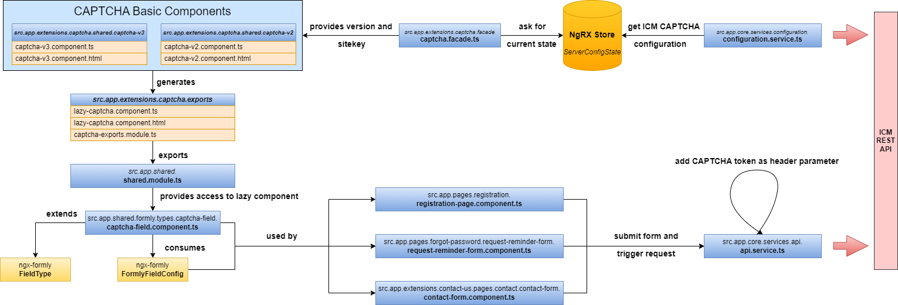
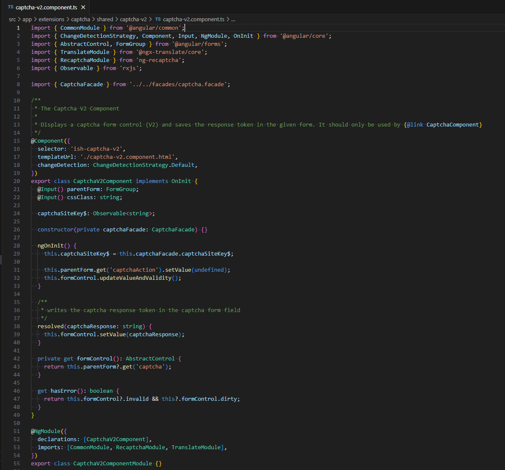
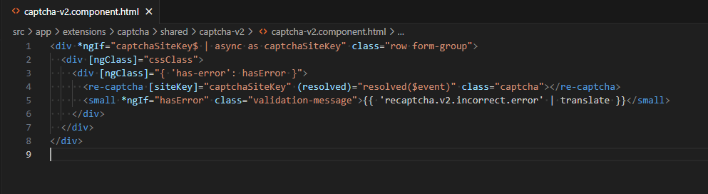
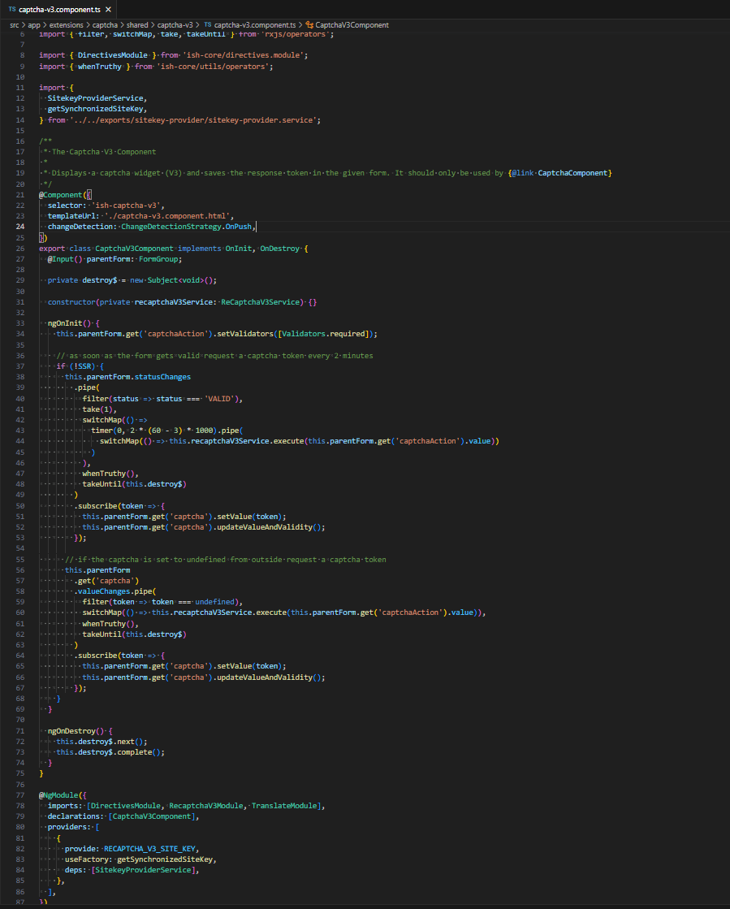

<!--
kb_concepts
kb_pwa
kb_everyone
kb_sync_latest_only
-->

# CAPTCHA in the PWA

## Introduction

Both reCAPTCHA V2 and reCAPTCHA V3 are implemented in the PWA. Which CAPTCHA version is used depends on which CAPTCHA service is created in the ICM. The pure implementation of the CAPTCHA functionality is stored in an extensions folder. From these basic components, a common lazy component is generated. This, in turn, is made available in a _shared module_ to all web forms located in the PWA.

The PWA uses the [Angular Formly framework](https://formly.dev/docs/guide/getting-started) to process web forms. The framework allows you to define types that can be used by the fields of the form. A special type has been implemented to integrate the CAPTCHA functionality. You can bind a field of this type to any _formly_ form, so that this form is validated according to CAPTCHA.

# High Level Overview

The following class diagram shows the major classes of the CAPTCHA workflow that are relevant for most use cases.



The overview diagram shows:

- _CAPTCHA Basic Components_ contains the recommended necessary UI components to integrate the Google reCAPTCHA service.
- The generated lazy components serve to ensure that this component is reloaded asynchronously.
- The CAPTCHA facade contains methods for determining the sitekey and the reCAPTCHA version used.
- The PWA uses the Formly framework for web forms. This allows you to create specific types for the input fields. The types can be used to define the properties of the input field. A separate type is available for the reCAPTCHA functionality.
- The three components (_registration-page.component.ts_, _request-reminder-form.component.ts_, _contact-form.component.ts_) contain Formly forms that contain a field of the CAPTCHA type.
- When these forms are submitted, the CAPTCHA token is set as a header parameter to the subsequent REST request. (If CAPTCHA V3 is used, the CAPTCHA action is also set as a header parameter).
- The CAPTCHA validation takes place on ICM side. If the score exceeds the threshold configured in the managed service, the request is rejected.

# Integration of the CAPTCHA Components

As mentioned above, a special CAPTCHA field type has been created. This makes it very easy to protect any web form by using the CAPTCHA functionality. The following example shows how to attach a CAPTCHA type _‘ish-captcha-field’_ field to any Formly form.

First, the component's TypeScript file:

```
export class ExamplePageComponent implements OnInit {
  ...
  fields: FormlyFieldConfig[];
  exampleFormGroup = new UntypedFormGroup({});
  ...
  ngOnInit() {
    ...
    this.fields = [
        {
          type: 'ish-captcha-field',
          props: {
            topic: 'forgotPassword',
          },
        },
      ];
  }
 ...
}
```

The type _‘ish-captcha-field’_ is registered in the _src.app.shared.formly.types.**types.module.ts**_. Additionally, the module binds the corresponding field component to this type. The topic to be set corresponds to the CAPTCHA channel preferences selectable in ICM. If these preferences are disabled in ICM, CAPTCHA validation for this topic is also disabled in the PWA.

The following table shows the mapping between the existing PWA CAPTCHA topic names and the CAPTCHA channel preferences in the ICM:

| **CaptchaTopic**                     | **ICM Settings**                        |
| ------------------------------------ | --------------------------------------- |
| contactUs                            | Contact Us                              |
| emailShoppingCart                    | E-mail Shopping Cart                    |
| forgotPassword                       | Forgot password                         |
| redemptionOfGiftCardsAndCertificates | Redemption of Gift Cards & Certificates |
| register                             | Registration                            |

> :exclamation: This topic value will also append to the header of the request triggered by submitting the web form. This is necessary to support the [actions concept of Google reCAPTCHA v3](https://developers.google.com/recaptcha/docs/v3#actions).

For the sake of completeness, also the HTML file of the component:

```
<form name="ExampleForm" [formGroup]="exampleFormGroup" (ngSubmit)="submitForm()">
  <formly-form [form]="exampleFormGroup" [fields]="fields"></formly-form>

  <div class="row form-group">
    <div class="offset-md-4 col-md-8">
      <button
        type="submit"
        value="exampleButtonValue"
        name="exampleButtonName"
        class="btn btn-primary"
        [disabled]="buttonDisabled"
      >
        {{ 'example.form.send.button.label' | translate }}
      </button>
    </div>
  </div>
</form>
```

# Basic Components

As you can see in the high-level overview, there are components that represent the actual CAPTCHA functionality. Depending on the version used, these components implement either widgets provided by Google or the reCAPTCHA token functionality. The [ng-recaptcha](https://github.com/DethAriel/ng-recaptcha) library was used for the implementation.

The table shows all the basic components provided by the PWA:

| **reCAPTCHA V2**                                                             | **reCAPTCHA V3**                                                             |
| ---------------------------------------------------------------------------- | ---------------------------------------------------------------------------- |
| _src.app.extensions.captcha.shared.captcha-v2.**captcha-v2.component.ts**_   | _src.app.extensions.captcha.shared.captcha-v3.**captcha-v3.component.ts**_   |
| _src.app.extensions.captcha.shared.captcha-v2.**captcha-v2.component.html**_ | _src.app.extensions.captcha.shared.captcha-v3.**captcha-v3.component.html**_ |

# CAPTCHA V2

| **captcha-v2.component.ts**                             | **captcha-v2.component.html**                               |
| ------------------------------------------------------- | ----------------------------------------------------------- |
|  |  |

To add the widgets provided by Google, you need to import the **ReCAPTCHAModule** of the _ng-recaptcha_ library. Furthermore, _captcha site key_ must be set to initialize the widget. This site key is a required option on the reCAPTCHA HTML element. It is also necessary to store the token determined by the CAPTCHA event as a form control parameter, see resolved function. This allows the response to be validated and handled accordingly. In case of an error, an error message is displayed; in case of success, the entire form is processed further.

# CAPTCHA V3

| **captcha-v3.component.ts**                             | **captcha-v3.component.html**                           |
| ------------------------------------------------------- | ------------------------------------------------------- |
|  |  |

To implement a callback function to handle the token, you need to import the **RecaptchaV3Module** of the _ng-recaptcha_ library. This component will trigger a callback every 2 minutes to retrieve a current reCAPTCHA token. This token is then appended to the request triggered by the submitted form. The ICM backend will then validate the token.

# Further References

- [Intershop Knowledge Base | Concept - ReCaptcha v3](https://support.intershop.com/kb/index.php/Display/29X281)
- [Intershop Knowledge Base | Concept - ReCaptcha v2](https://support.intershop.com/kb/index.php/Display/2794B3)
- [Getting Started | Formly](https://formly.dev/docs/guide/getting-started)
- [GitHub - DethAriel/ng-recaptcha: Angular component for Google reCAPTCHA](https://github.com/DethAriel/ng-recaptcha)
- [Developer's Guide | reCAPTCHA | Google for Developers](https://developers.google.com/recaptcha/intro)
