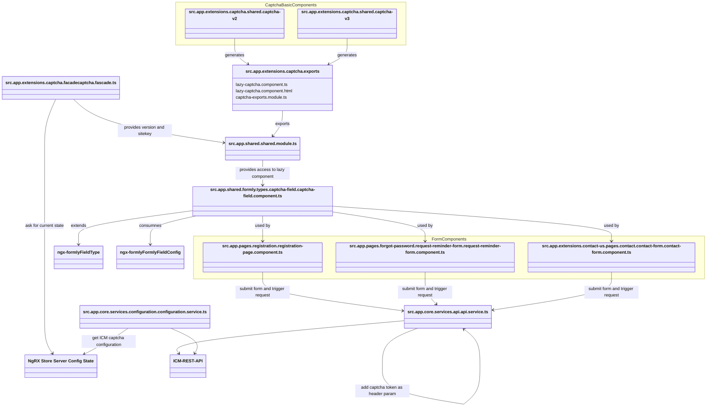

<!--
kb_concepts
kb_pwa
kb_everyone
kb_sync_latest_only
-->

# Authentication Concept

## Introduction

Both reCAPTCHA V2 and reCAPTCHA V3 are implemented in the PWA. Which CAPTCHA version is used depends on which CAPTCHA service is created in the ICM. The pure implementation of the captcha functionality is stored in an extensions folder. A common lazy component is generated from these basic components. This in turn is made available in a shared module for any webforms located in the PWA.

The PWA uses the [Angular Formly framework](https://formly.dev/docs/guide/getting-started) to process webforms. With the framework you have the possibility to define types which can be used by the fields of the form. A separate type was implemented for the integration of the CAPTCHA functionality. In the following, you can bind a field of this type to any formly form, so that this form is validated according to CAPTCHA.

??? References

??? Glossary

# High Level Overview

The following class diagram shows the major classes of the CAPTCHA workflow that are relevant for the most use cases.



The overview diagram shows:

- Captcha Basic Components contains the recommended necessary UI components to integrate the Google ReCaptcha service.
- The generated lazy components serve to ensure that this component is reloaded asynchronously.
- The captcha fascade contains methods for determining the sitekey and the reCaptcha version used.
- The PWA uses the formly framework for webforms. This allows you to create specific types for the input fields. The types can be used to define the properties of the input field. A separate type was created for the recaptcha functionality.
- The three components (registration-page.component.ts, request-reminder-form.component.ts, contact-form.component.ts) contain formly forms that contain a field of the captcha type.
- When these forms are submitted, the captcha token is set as a header parameter to the subsequent REST request. (In case CAPTCHA V3 is used then also the captcha action is set as header parameter.)
- The captcha validation takes place on the ICM side. If the threshold value configured in the managed service for the score is exceeded, the request is rejected.

# Integration of the CAPTCHA components

As mentioned above, a special captcha field type has been created. This makes it very easy to protect any webform by using the captcha functionality. The following example shows how to attach a captcha type ‘ish-captcha-field’ field to any formly form.

First the TypeScript file of the component:

```
export class ExamplePageComponent implements OnInit {
  ...
  fields: FormlyFieldConfig[];
  exampleFormGroup = new UntypedFormGroup({});
  ...
  ngOnInit() {
    ...
    this.fields = [
        {
          type: 'ish-captcha-field',
          props: {
            topic: 'forgotPassword',
          },
        },
      ];
  }
 ...
}
```

The type ‘ish-captcha-field’ is registered in the src.app.shared.formly.types.types.module.ts. Additionally, the module binds the corresponding field component to this type. The topic which is to set corresponds to the ICM selectable captcha channel preferences. If this preferences are disable in the ICM than the captcha validation for this topic is also disabled in the PWA.

The table shows the mapping between the existing PWA captcha topic names and the captcha channel preferences in the ICM:

| **CaptchaTopic**                     | **ICM Settings**                        |
| ------------------------------------ | --------------------------------------- |
| contactUs                            | Contact Us                              |
| emailShoppingCart                    | E-mail Shopping Cart                    |
| forgotPassword                       | Forgot password                         |
| redemptionOfGiftCardsAndCertificates | Redemption of Gift Cards & Certificates |
| register                             | Registration                            |

This topic value will also append to the header of the request who is triggered by submitting of the webform. This is necessary to support the [actions concept of Google reCAPTCHA v3](https://developers.google.com/recaptcha/docs/v3#actions).

For the sake of completeness, also the HTML file of the component:

```
<form name="ExampleForm" [formGroup]="exampleFormGroup" (ngSubmit)="submitForm()">
  <formly-form [form]="exampleFormGroup" [fields]="fields"></formly-form>

  <div class="row form-group">
    <div class="offset-md-4 col-md-8">
      <button
        type="submit"
        value="exampleButtonValue"
        name="exampleButtonName"
        class="btn btn-primary"
        [disabled]="buttonDisabled"
      >
        {{ 'example.form.send.button.label' | translate }}
      </button>
    </div>
  </div>
</form>
```

# Basic Components

As you can see in the high level overview, there are components that represent the actual CAPTCHA functionality. Depending on the version used, either widgets provided by google or the recaptcha token functionality are implemented in these components. The [ng-recaptcha](https://github.com/DethAriel/ng-recaptcha) library was used for the implementation.

The table shows all the basic components provided by the PWA:

| **reCAPTCHA V2**                                                             | **reCAPTCHA V3**                                                             |
| ---------------------------------------------------------------------------- | ---------------------------------------------------------------------------- |
| _src.app.extensions.captcha.shared.captcha-v2.**captcha-v2.component.ts**_   | _src.app.extensions.captcha.shared.captcha-v3.**captcha-v3.component.ts**_   |
| _src.app.extensions.captcha.shared.captcha-v2.**captcha-v2.component.html**_ | _src.app.extensions.captcha.shared.captcha-v3.**captcha-v3.component.html**_ |

# Captcha V2

| **captcha-v2.component.ts** | **captcha-v2.component.html** |
| --------------------------- | ----------------------------- |
| ???                         | ???                           |

To add the widgets provided by Google, the **RecaptchaModule** of the _ng-recatcha_ library has to be imported. Furthermore the determination of the _captcha site key_ is necessary for the initialization of the widget. This site key is a required option on the recaptcha html element. Furthermore, it is necessary that the token determined by the captcha event is saved as a form control parameter, see resolved function. This makes it possible to validate the response and handle it accordingly. In the event of an error, an error message is displayed; in the event of success, the entire form is processed further.

# Captcha V3

| **captcha-v3.component.ts** | **captcha-v3.component.html** |
| --------------------------- | ----------------------------- |
| ???                         | ???                           |

To implement a callback function to handle the token it is necessary to import the **RecaptchaV3Module** of the _ng-recatcha_ library. For this component every 2 minutes the callback will triggered to get a current recaptcha token. This token is then attached to the request triggered by the transmitted form. The ICM backend then validates the token.
