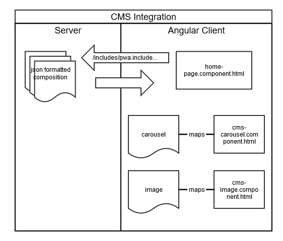

<!--
kb_concepts
kb_pwa
kb_everyone
kb_sync_latest_only
-->

# CMS Integration

## Introduction

The Intershop REST API contains resources reflecting the aspects of Intershop's integrated Content Management System (CMS), i.e.
Pagelets, Includes, Pages.

Calling the `/cms` resource will list the available CMS sub resources for the different CMS artifacts.

```json
{
  "elements": [
    {
      "type": "Link",
      "uri": "inSPIRED-inTRONICS-Site/-/cms/viewcontexts",
      "title": "viewcontexts"
    },
    {
      "type": "Link",
      "uri": "inSPIRED-inTRONICS-Site/-/cms/includes",
      "title": "includes"
    },
    {
      "type": "Link",
      "uri": "inSPIRED-inTRONICS-Site/-/cms/pagelets",
      "title": "pagelets"
    },
    {
      "type": "Link",
      "uri": "inSPIRED-inTRONICS-Site/-/cms/pages",
      "title": "pages"
    },
    {
      "type": "Link",
      "uri": "inSPIRED-inTRONICS-Site/-/cms/pagetree",
      "title": "pagetree"
    }
  ],
  "type": "ResourceCollection"
}
```

With this API, a client can retrieve a composition of involved CMS objects (e.g. include, component, slot, component and so on).
It is the client's responsibility to interpret and "render" such a composition tree.
In the PWA this is done by mapping each element onto an Angular specific render component.



## Angular CMS Components

A CMS render component in Angular has to fulfill the following requirements:

- It is declared in the `CMSModule`.
- The component must have an input for the assigned pagelet.
- It is added to the `CMSModule` as an `entryComponent` (required, so a factory is generated as it is not referenced directly).
- A mapping has to be provided in the `CMSModule` to map the `definitionQualifiedName` of the ICM realm to the PWA render component.
- It needs to implement the `CMSComponent` interface.

```typescript
providers: [
  {
    provide: CMS_COMPONENT,
    useValue: {
      definitionQualifiedName: 'app_sf_customer_cm:component.custom.inventory.pagelet2-Component',
      class: CMSInventoryComponent,
    },
    multi: true,
  },
];
```

When using `ng generate` with PWA custom schematics, you can apply all those changes described automatically.
For example, the following code block creates a new Angular component named `cms-inventory` and registers it with the `CMSModule`.

```bash
$ ng generate cms inventory --definition-qualified-name app_sf_customer_cm:component.custom.inventory.pagelet2-Component
CREATE src/app/cms/components/cms-inventory/cms-inventory.component.ts (386 bytes)
CREATE src/app/cms/components/cms-inventory/cms-inventory.component.html (32 bytes)
CREATE src/app/cms/components/cms-inventory/cms-inventory.component.spec.ts (795 bytes)
UPDATE src/app/cms/cms.module.ts (4956 bytes)
```

## Design Preview

In conjunction with Intershop Commerce Management (ICM) 7.10.39.1, Intershop PWA 3.3.0 introduced basic support for a design preview.
This means the _Design View_ tab in the ICM backoffice can be used to preview content changes in the PWA, but without any direct editing capabilities.
Direct item preview for products, categories and content pages works now as well in the context of the PWA.

The preview feature basically consists of the [`PreviewService`](../../src/app/core/utils/preview/preview.service.ts) that handles the preview functionality by listening for `PreviewContextID` initialization or changes and saving it to the browser session storage.
The [`PreviewInterceptor`](../../src/app/core/interceptors/preview.interceptor.ts) than handles adding a currently available PreviewContextID as matrix parameter `;prectx=` to all REST requests so they can be evaluated on the ICM side returning content fitting to the set preview context.

To end a preview session and to delete the saved `PreviewContextID` in the browser session storage, use the _Finish Preview_ button of the _Design View_ configuration.

## Integration with an External CMS

Since the Intershop PWA can integrate any other REST API in addition to the ICM REST API, it should not be a problem to integrate an external 3rd party CMS that provides an own REST API, instead of using the integrated ICM CMS.
Even combinations would be possible.

In case an external API has to be integrated, the native Angular `httpClient` must to be used for the REST calls instead of the PWA's `apiService`.
In addition, the mapping of content to the according places in the PWA needs to be handled in a way fitting to the external CMS.
