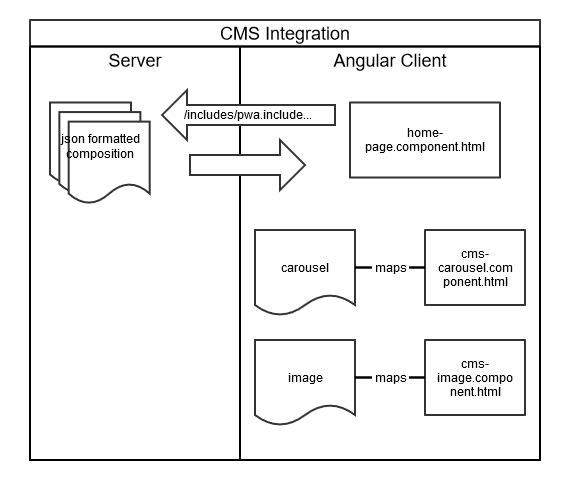

<!--
kb_concepts
kb_pwa
kb_everyone
kb_sync_latest_only
-->

# CMS Integration

- [Introduction](#introduction)
- [Angular CMS Components](#angular-cms-components)
- [Navigation Components](#navigation-components)
- [Account Content Pages](#account-content-pages)
- [View Contexts](#view-contexts)
  - [View Context Requests with Resource Set ID](#view-context-requests-with-resource-set-id)
- [Design View](#design-view)
- [Integration with an External CMS](#integration-with-an-external-cms)

## Introduction

The Intershop REST API contains resources reflecting the aspects of Intershop's integrated Content Management System (CMS), i.e.,
Pagelets, Includes, Pages.

Calling the `/cms` resource will list the available CMS sub-resources for the different CMS artifacts.

```json
{
  "elements": [
    {
      "type": "Link",
      "uri": "inSPIRED-inTRONICS-Site/-/cms/viewcontexts",
      "title": "viewcontexts"
    },
    {
      "type": "Link",
      "uri": "inSPIRED-inTRONICS-Site/-/cms/includes",
      "title": "includes"
    },
    {
      "type": "Link",
      "uri": "inSPIRED-inTRONICS-Site/-/cms/pagelets",
      "title": "pagelets"
    },
    {
      "type": "Link",
      "uri": "inSPIRED-inTRONICS-Site/-/cms/pages",
      "title": "pages"
    },
    {
      "type": "Link",
      "uri": "inSPIRED-inTRONICS-Site/-/cms/pagetree",
      "title": "pagetree"
    }
  ],
  "type": "ResourceCollection"
}
```

With this API, a client can retrieve a composition of involved CMS objects (e.g., include, component, slot, component, and so on).
It is the client's responsibility to interpret and "render" such a composition tree.
In the PWA, this is done by mapping each element onto an Angular-specific render component.



## Angular CMS Components

A CMS render component in Angular has to fulfill the following requirements:

- It is declared in the `CMSModule`.
- The component must have an input for the assigned pagelet.
- It is added to the `CMSModule` as an `entryComponent` (required, so that a factory is generated, as it is not referenced directly).
- A mapping must be provided in the `CMSModule` to map the `definitionQualifiedName` of the ICM realm to the PWA render component.
- It needs to implement the `CMSComponent` interface.

```typescript
providers: [
  {
    provide: CMS_COMPONENT,
    useValue: {
      definitionQualifiedName: 'app_sf_customer_cm:component.custom.inventory.pagelet2-Component',
      class: CMSInventoryComponent,
    },
    multi: true,
  },
];
```

When using `ng generate` with PWA custom schematics, you can apply all those changes described automatically.
For example, the following code block creates a new Angular component named `cms-inventory` and registers it with the `CMSModule`.

```bash
$ ng generate cms-component inventory --definition-qualified-name app_sf_customer_cm:component.custom.inventory.pagelet2-Component
CREATE src/app/cms/components/cms-inventory/cms-inventory.component.ts (386 bytes)
CREATE src/app/cms/components/cms-inventory/cms-inventory.component.html (32 bytes)
CREATE src/app/cms/components/cms-inventory/cms-inventory.component.spec.ts (795 bytes)
UPDATE src/app/cms/cms.module.ts (4956 bytes)
```

## Navigation Components

With Intershop PWA release 5.1.0, three new CMS rendering components were introduced that can be used to extend the main navigation.

| Component           | Description                                                                                  |
| ------------------- | -------------------------------------------------------------------------------------------- |
| Navigation Category | Renders a main navigation entry based on the selected category with optional sub-navigation. |
| Navigation Link     | Renders a main navigation entry to the given link with optional sub-navigation.              |
| Navigation Page     | Renders a main navigation entry based on the selected page with optional sub-navigation.     |

The corresponding content models to configure these new components in ICM are part of `icm-as-customization-headless:1.7.0` (ICM 11.9.0).
They are all assignable to the _Header - Navigation_ include and can be combined to extend the main navigation.
It is also possible to completely configure the main navigation with these components without the default main navigation by only rendering the `<ish-lazy-content-include includeId="include.header.navigation.pagelet2-Include"/>` in the `HeaderNavigationComponent`.
To fulfill such a requirement, the source code needs to be adapted accordingly.

All three components allow the configuration of additional freestyle HTML that is rendered within the sub-navigation layer.
The root element as well as the depth of the sub-navigation tree are configurable for the _Navigation Category_ and the _Navigation Page_ components.

## Account Content Pages

Intershop PWA 8.0.0 introduces the integration of CMS content pages into the My Account area.
This means that content pages that can be created and managed in ICM can be rendered in a My Account context.
Specifically, these pages are rendered with the standard page layout of the My Account area, including the left navigation and the My Account breadcrumb.
For CMS content components on such pages, all assignable standard component templates can be used, except for the _Static Content_ component template that would render its own breadcrumb and optional navigation.
This component template is intended for standalone content pages or content page hierarchies outside the My Account area.

The route to a content page in the My Account area is `/account/content/<PAGE_ID>`.

In this way, they can be integrated into the My Account navigation via `account-navigation.items.ts`:

```typescript
{
  id: 'example-page',
  localizationKey: 'account.navigation.example_page.link',
  routerLink: '/account/content/example-page',
},
```

It is also possible to use the _Account - General - Navigation Bar_ content include to assign a Freestyle HTML component that contains additional account navigation links to content pages (see the following example).

```html
<ul class="account-navigation list-unstyled">
  <li class="account-nav-header"><span>Additional</span></li>
  <li><a class="link-decoration-hover" href="route://account/content/example-page">Example</a></li>
  <li>
    <a class="link-decoration-hover" href="route://account/content/page.termsAndConditions.pagelet2-Page">Terms</a>
  </li>
</ul>
```

## View Contexts

With the Intershop PWA version 2.0.0, we introduced demo/example view contexts, which were disabled by default with Intershop PWA 5.2.0.
Each integrated view context triggers a REST call that potentially decreases the SSR rendering performance, which is not necessary if this feature is not actively used in a PWA project.
If the used ICM does not have the integrated view context instances configured, the requests result in 404 responses, which is not helpful either.
For that reason, the examples were commented out in the source code and must be activated in the project source code if needed.

The PWA is prepared to work with the following set of view contexts:

```
viewcontext.include.category.base.bottom
viewcontext.include.category.base.top
viewcontext.include.category.content.bottom
viewcontext.include.category.content.top
viewcontext.include.category.navigation
viewcontext.include.family.base.bottom
viewcontext.include.family.base.top
viewcontext.include.family.content.bottom
viewcontext.include.family.content.top
viewcontext.include.family.navigation
viewcontext.include.product.base.bottom
viewcontext.include.product.base.top
viewcontext.include.product.content.bottom
viewcontext.include.product.content.top
viewcontext.include.product.productinfo
```

To easily add these view contexts to the used ICM (other than the inSPIRED demo data that already contains these view contexts), a content import file is provided in the project sources ([`src/assets/sample-data/view_contexts_import.xml`](../../src/assets/sample-data/view_contexts_import.xml)) that can be imported on organization level.

To activate the view contexts in the PWA, search for `<!-- DISABLED VIEW CONTEXT --` and `-- DISABLED VIEW CONTEXT -->` and remove these lines around the view contexts you want to use.
Be aware that enabling view contexts requires adapting some Jest component tests (`MockComponent(ContentViewcontextComponent),`).

> [!NOTE]
> The default view contexts are examples for demonstration purposes that could be used in the same way in a customer project.
> It is advised, however, to evaluate which view contexts are indeed needed in the project and to activate those accordingly, or to create the ones that meet the project requirements even better.

### View Context Requests with Resource Set ID

The REST requests to ICM to get CMS view context data are more performant if a resource set ID is provided.

Without resource set ID, the request is less performant due to expensive cartridge lookups:

```
/cms/viewcontexts/viewcontext.include.product.base.top/entrypoint?Product=201807181
```

With resource set ID, the request is more performant when the view context model cartridge is provided:

```
/cms/viewcontexts/viewcontext.include.product.base.top@app_sf_base_cm/entrypoint?Product=201807181
```

With PWA 11.0.0, the Intershop PWA automatically adds the resource set ID to view context REST requests via configured `defaultResourceSetId` defined at the [`CMSService`](../../src/app/core/services/cms/cms.service.ts).
The default resource set ID is configured to the standard ICM cartridge name that contains the defining view context models: `app_sf_base_cm`.
The resource set ID can be overridden at the individual view context inclusion by providing the `resourceSetId` input parameter at the `ish-content-viewcontext` component.

```html
<ish-content-viewcontext
  viewContextId="viewcontext.include.product.base.top"
  [callParameters]="{ Product: product.sku }"
  resourceSetId="custom_cartridge_name"
/>
```

If `app_sf_base_cm` is not the correct resource set ID for the view contexts used in the project, you can also change the `defaultResourceSetId` at the `CMSService` to avoid adding the `resourceSetId` input parameter to every `ish-content-viewcontext` usage.

> [!NOTE]
> Using view context REST requests with the added resource set ID requires ICM 12.1.0.

## Design View

> [!IMPORTANT]
> To use the Design View for the PWA within the Intershop Administration Portal, ICM version 11.7.0 or above is needed.

The Intershop PWA 5.0.0 introduces experimental support for the Design View that can be used within the Intershop Administration Portal (IAP).
In addition to access to the IAP, you require ICM 11+ that provides the necessary CMS Management REST API to get information about available CMS models, the CMS page tree, and to edit CMS components.

The Design View in the IAP currently only supports content editing but not content preview.

## Integration with an External CMS

Since the Intershop PWA can integrate any other REST API in addition to the ICM REST API, it is no problem to integrate an external 3rd party CMS that provides an own REST API, instead of using the integrated ICM CMS.
Even combinations are possible.

If an external API has to be integrated, the native Angular `httpClient` must be used for the REST calls instead of the PWA's `apiService`.
In addition, the mapping of content to the corresponding places in the PWA needs to be handled in a way that fits to the external CMS.
