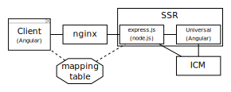

<!--
kb_concepts
kb_pwa
kb_everyone
kb_sync_latest_only
-->

# Hybrid Approach

This document describes how to run PWA and ICM in hybrid mode, so that pages from the Intershop Progressive Web App and pages from the classic storefront can be run in parallel.

A possible scenario would be to have the shopping experience with all its SEO optimizations handled by the PWA and to delegate highly customized parts of the checkout or my account area to the ICM.

## Requirements

- ICM 7.10.16.6
- PWA 0.18

## Architectural Concept



For a minimal-invasive implementation, the mechanics for the hybrid approach are mainly implemented outside of the ICM and in deployment-specific components of the PWA.

The ICM is proxied in the _express.js_ server of the server-side rendering process and hereby made available to the outside.
A newly introduced mapping table is also used to decide when an incoming request should be handled by the PWA or the ICM.
This mapping table is also used in the PWA for switching from the context of the single page application to the ICM.

## Configuration

### Intershop Commerce Management

The ICM must be run with [Secure URL-only Server Configuration](https://docs.intershop.com/icm/7.10/olh/oma/en/search.html?searchQuery=SecureAccessOnly), which can be done by adding `SecureAccessOnly=true` to the appserver configuration.

Furthermore the synchronization of the `apiToken` cookie must be switched on, so that users and baskets are synchronized between PWA and ICM.
See [Concept - Integration of Progressive Web App and inSPIRED Storefront](https://support.intershop.com/kb/index.php/Display/2928F6).

If you also want to support the correct handling for links generated in e-mails, the property `intershop.WebServerSecureURL` must point to nginx.

_\$SERVER/share/system/config/cluster/appserver.properties_:

```properties
SecureAccessOnly=true
intershop.apitoken.cookie.enabled=true
intershop.apitoken.cookie.sslmode=true
intershop.WebServerSecureURL=https://<nginx>
```

### Intershop Progressive Web App

The server-side rendering process must be started with `SSR_HYBRID=1`.

In addition, the PWA must be run with secure URLs as well.
This can be achieved with `SSL=1`.

> :warning: **Only for development environments**: It might be necessary to set `TRUST_ICM=1` if the used development ICM is deployed with an insecure certificate.

Also, the **Service Worker must be disabled** for the PWA, as it installs itself into the browser of the client device and takes over the routing process, making it impossible to break out of the PWA and delegate to the ICM.

### Mapping Table

The mapping table resides in the PWA source code and provides the page-specific mapping configuration for the hybrid approach.

```typescript
  {
    id: "Product Detail Page",
    icm: `${ICM_CONFIG_MATCH}/ViewProduct-Start.*(\\?|&)SKU=(?<sku>[\\w-]+).*$`,
    pwaBuild: `product/$<sku>${PWA_CONFIG_BUILD}`,
    pwa: `^.*/product/([\\w-]+).*$`,
    icmBuild: `ViewProduct-Start?SKU=$1`,
    handledBy: "icm"
  }
```

Each entry contains:

- A regular expression to detect a specific incoming URL as ICM or PWA URL (`icm` and `pwa`)
- Corresponding instructions to build the matching URL of the counterpart (`pwaBuild` and `icmBuild`)
- A property `handledBy` (either `icm` or `pwa`) to decide on the target upstream

The properties `icm` and `pwaBuild` can use [named capture groups](<https://2ality.com/2017/05/regexp-named-capture-groups.html#replace()-and-named-capture-groups>) and are only used in the _node.js_ process running on the server.
However, `pwa` and `icmBuild` are used in the client application where [named capture groups are not yet supported by all browsers](https://github.com/tc39/proposal-regexp-named-groups#implementations).

## PWA Adaptions

With version 0.23.0 the PWA was changed to no longer reuse the Responsive Starter Store application types but rather be based upon the newly introduced headless application type for REST Clients - `intershop.REST`.
This application type is completely independent of the Responsive Starter Store and is not suitable for storefront setups using the hybrid approach.
For this reason, the PWA must be adapted to work with the Responsive Starter Store again.

**Migration Steps to prepare the PWA for the hybrid approach with the Responsive Starter Store**

- Use a current PWA version
- Revert the following Git commits:

| commit                                                                                                  | comment                                                                                 |
| ------------------------------------------------------------------------------------------------------- | --------------------------------------------------------------------------------------- |
| [50dc72ef0](https://github.com/intershop/intershop-pwa/commit/50dc72ef083d6bee3c33edebef275b85762db618) | feat: switch to the new headless REST application type CMS content model (#302)         |
| [741454c8c](https://github.com/intershop/intershop-pwa/commit/741454c8c839dd001a3943236172d75ffd05541d) | feat: switch to the new headless REST application type applications demo content (#302) |

- Configure the correct `icmApplication` setting
- Add needed PWA specific Content Includes in the Responsive Starter Store
  - Via `componentEntryPointDefinitions` in the ICM project source code
- Follow the Hybrid configuration setup

# Further References

- [Guide - Building and Running Server-Side Rendering](../guides/ssr-startup.md)
- [Guide - Handle rewritten ICM URLs in Hybrid Mode](../guides/hybrid-approach-icm-url-rewriting.md)
- [Concept - Multi-site handling](multi-site-handling.md)
