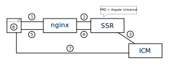

<!--
kb_concepts
kb_pwa
kb_everyone
kb_sync_latest_only
-->

# Building Blocks of the Intershop PWA Public Deployment

## Intershop Commerce Management (ICM)

The Intershop Commerce Management (ICM) provides the necessary data for running the [default Intershop PWA deployment](https://intershoppwa.azurewebsites.net/home) via a REST API.
Since release [0.23](https://github.com/intershop/intershop-pwa/releases/tag/0.23.0), it uses the new headless application type (see [Migrations - 0.22 to 0.23](../guides/migrations.md#022-to-023)).

Using another backend is also possible as long as it provides a [compatible REST API](cms-integration.md#integration-with-an-external-cms).

## PWA - Server-Side Rendering (SSR)

In order to facilitate server-side rendering (SSR), the default deployment uses a dockerized [_express.js_](https://expressjs.com/) server running [Angular Universal](https://angular.io/guide/universal).
On a new request, Angular Universal pre-renders the page and instantly provides the browser with meaningful content.
For an architectural overview of how SSR functions in the Intershop PWA, see [Deployment Scenarios](deployment-angular.md).
Pre-rendering pages enables a number of features:

- **SEO compatibility**: Many web crawlers have no or only a limited capability to interpret JavaScript code. To make single-page applications like the Intershop PWA accessible to search engines, SSR is necessary. Pre-rendered pages can easily be crawled and indexed. For more information, see [Search Engine Optimization](search-engine-optimization.md).
- **Dynamic configurations**: Using SSR allows for safe, dynamic configuration of the Intershop PWA through various URL parameters (see [Configuration](configuration.md)). For example, server-side parameter configuration enables [multi-site](multi-site-handling.md) and [multi-theme](../guides/multiple-themes.md) handling.
- **Hybrid approach**: Via the _express.js_ server, URLs can be remapped to allow dynamic integration of specific _Responsive Starter Store_ pages. See [Hybrid Approach](hybrid-approach.md) for more information.

For an overview of the ever-growing list of third party integrations relating to SSR and deployment in general, see [Third-party Integrations](../README.md#third-party-integrations).

## PWA - Nginx

As a first point of contact for any browser requests directed at a default deployment, the custom [_nginx_](https://www.nginx.com/) reverse proxy webserver serves a number of functions.
Each of these is seperately configurable (see [Building and Running nginx Docker Image](../guides/nginx-startup.md)).
Nginx enables the following features to be used in an Intershop PWA deployment:

- Uncomplicated caching of PWA server-side rendering responses provided by the upstream Angular Universal server.
- Integration of the [PageSpeed Module](https://www.modpagespeed.com/) for access to different browser optimizations.
- Handling of multiple channels via URL parameters in conjunction with SSR (see [Multi-Site Handling](multi-site-handling.md)).
- Customizable compression for downstream services
- Device type detection to ensure a correct pre-render, adapted to the incoming user agent.

For an overview of the ever-growing list of third party integrations relating to nginx and deployment in general, see [Third-party Integrations](../README.md#third-party-integrations).

## Browser

The browser runs the bootstrapped/pre-rendered Angular application.
After initially communicating with the _nginx_ webserver, later REST requests are directed to the configured ICM endpoint or custom backend.
For more information on the browser's role in rendering the Intershop PWA, see [Deployment Scenarios for Angular Applications](deployment-angular.md).

# Default Production Deployment

Chaining the building blocks together results in the depicted system.
Read on for a step-by-step walkthrough of the initial connection request.

1. The browser requests the page by URL from the nginx.

   1. If the cache is enabled and a cached response is found, the response is returned immediately, go to 6.
   2. If no cached response is available, the SSR process is triggered.

2. The node _express.js_ server runs Angular Universal pre-rendering for the requested URL.

3. Angular Universal fills the requested page with content retrieved via the ICM REST API.

4. The response is delivered to nginx, where it is also cached if caching is enabled.

5. The response is delivered to the browser.

6. The initial page response is displayed to the user and the Angular Client application boots up in the browser.

7. Once booted up, additional REST Calls are directed straight to the ICM and the PWA acts as a single-page application. No further HTML pages are requested.

## Deployment Without Nginx

Deployment without using nginx is theoretically possible, even though many useful features of an nginx deployment are obviously not available.

> :warning: Enabling [service workers](progressive-web-app.md#service-worker) is not possible without using nginx. The Intershop PWA will not function as intended if you do.

## Hiding the ICM Backend

For security reasons, it may be desirable to hide the backend address and prevent direct access to it.
The Intershop PWA supports this functionality and the [default deployment](https://intershoppwa.azurewebsites.net/home) uses this feature.
To enable it, set the `PROXY_ICM` environment variable on the [SSR container](../guides/ssr-startup.md) to a new URL.
Instead of directing REST calls straight to the ICM (see step seven in the [Default Production Deployment](#default-production-deployment)), traffic is routed through the SSR container.
The _express.js_ server is set up to proxy requests.
Upon completing the Angular Universal pre-rendering, all URLs referring explicitly to the used ICM (links, images, configuration) are replaced with URLs to the proxy.

## Stateless vs. Stateful Building Blocks

For scalability and parallelization reasons, considering whether each building block is stateful or stateless is important.
The **ICM** deals with large databases, caches write and read requests and therefore manages a high amount of internal states.
Substituting ICM instances at runtime and managing fail-over capacities is not trivial.
The **SSR container** acts like a pure function.
Making the same request is always going to return the same result.
This way, setting up multiple instances, rebooting containers at runtime or even setting up serverless deployments are all possible.
It is important to keep the stateless nature of the Intershop PWA in mind when writing new code and expanding its functionalities.
The **nginx container** is not technically stateless, since it handles caching of SSR responses.
However, nginx is not functionally dependent on its internal state like the ICM is.
If an nginx container were to lose its internal state, all cached responses would instead be passed on to the _express.js_ server and be answered at the cost of a delay.

# Further References

- [Guide - Building and Running Server-Side Rendering](../guides/ssr-startup.md)
- [Guide - Building and Running nginx Docker Image](../guides/nginx-startup.md)
- [Concept - Deployment Scenarios for Angular Applications](deployment-angular.md)
