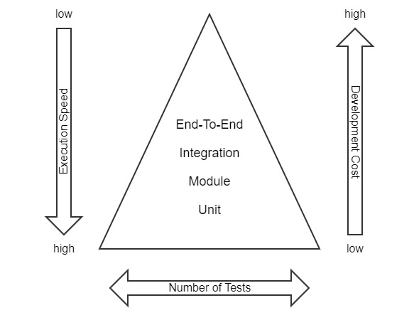

<!--
kb_concepts
kb_pwa
kb_everyone
kb_sync_latest_only
-->

# Testing the PWA

## Different Levels of Testing

Testing the PWA follows the basic principle of the test pyramid ([https://martinfowler.com/bliki/TestPyramid.html](https://martinfowler.com/bliki/TestPyramid.html)).

### Unit

Most of the testing should be done in low-level unit tests if possible.
These tests concern themselves with the behavior of a single unit of code, be it a function, a class or even an Angular component with HTML rendering.
All dependencies of that unit shall be mocked out to keep the scope as small as possible.
These tests are written in a [Jasmine](https://jasmine.github.io/)\-like style and executed with [Jest](https://facebook.github.io/jest/).
Running these tests can be very time-efficient and they serve as the primal short-circuit response to developers.

### Module

Following unit tests we also run module tests which serve as the first layer of integration tests.
With these tests more dependencies are instantiated in every single test to check the behavior when interconnecting more components.
Examples for these are testing a slice of the ngrx store or checking form validation with multiple Angular components.
They are also implemented using [Jest](https://facebook.github.io/jest/).

### Integration

The next layer of tests are integration tests which run the application as a whole but mock out ICM rest responses.
The test is run using a browser and performing various actions and checks on the application.
For this kind of test [Cypress](https://www.cypress.io/) is required.
The tests are written in a Jasmine-like behavior driven style.
For the ease of readability we implemented them using a _PageObject_ pattern, see [https://martinfowler.com/bliki/PageObject.html](https://martinfowler.com/bliki/PageObject.html).
Testing in this stage is of course more time-consuming as the application has to be compiled and started up as a whole.
Mocking server responses also limits the available workflows of the application.
For example designing mock-data for a complete customer journey through the checkout would be too complex and too brittle.
Nevertheless, the tests serve well for a basic overview of some functionality.

### End-to-End

The most time-consuming tests are complete end-to-end tests.
They do not mock out anything and run the PWA against an ICM with a deployed `a_responsive:inspired-b2x`.
We also use [Cypress](https://www.cypress.io/) here.
Additionally, all tests from the previous integration step should be composed in a way that they can also be run with real REST responses.
As a basic rule of thumb we only test happy path functionality or workflows that would be too cumbersome to be mocked in module tests.

## Test File Locations

Unit and module tests are closely located next to the production source code in the _src_ folder.

Integration and end-to-end tests currently reside in _cypress/integration/specs_. _PageObjects_ are located in _cypress/integration/pages_.
If the filename of a spec contains the string `mock`, it is run as an integration test with mocked server API.
If it (additionally) contains `b2c` or `b2b` the test also should run on the PWA set up with the corresponding channel.

## Deviation from Standard Angular Test Frameworks

By default Angular projects are setup with [Jasmine](https://jasmine.github.io/) and Karma Runner for unit and module tests, as well as [Protractor](https://www.protractortest.org) for end-to-end testing.
We decided to deviate from these frameworks, because there are better alternatives available.

[Jest](https://facebook.github.io/jest/) provides a better and faster experience when testing.
Jest uses a JavaScript engine comparable to a virtual browser.
There is no need to start up a real browser like it is standard with Jasmine and Karma.
Jest also provides an interactive command line interface with many options.
Integrations for VSCode are available that will ease developing and running tests.
Another big advantage of Jest is the functionality for [Snapshot Testing](https://jestjs.io/docs/en/snapshot-testing).

We also do not use Protractor for end-to-end testing.
Like all Selenium-based testing frameworks, Protractor deals with the same problems.
Special bindings for the programming language communicate via HTTP with a browser driver which then remotely controls the browser over HTTP.
This indirect way is very fragile against network latency.
Also the functionalities are limited.
Protractor, however, is especially designed for Angular, so it automatically waits for background tasks to finish before continuing the test run.
This functionality must be implemented when using Cypress.

Cypress uses a different approach for running end-to-end tests.
It runs directly in the browser and thus provides access to application internals like XHR-Monitoring, access to LocalStorage and so on.
The interface also provides page snapshots for debugging, which in turn eases the experience when writing tests or reconstructing bugs.
We use Cypress with a _PageObject_ pattern.

## PageObject Pattern

As mentioned earlier, we divide end-to-end tests in _PageObjects_ and Specs. _PageObjects_ abstract the HTML of the pages and offer a human-readable access possibility for the implementation of test-describing business processes.
In that way _PageObjects_ also make certain routines re-usable over all tests.
Specs use these provided _PageObject_ functions to make assertions and trigger actions. _PageObjects_ themselves should not make assertions.
All intended assertions should only be made in Specs.
Specs are the main entry point for developers.
All test-related data and intended behavior should only be available in each single file.

No form of abstraction shall be made when developing tests, especially not for re-using code.
Prefer composition and introduce action methods in _PageObjects_ instead.

## Handling Test Data

For unit and module tests test data is instantiated as required.
Each test should only set fields actually required for each test to ease readability.
If new dependencies are introduced or workflows change, the corresponding test cases have to change, too.

Integration and end-to-end tests are tailored for the inSPIRED (_a_responsive_) demo store.
Used test data can be abstracted at the start of the file but at all times it should only be accumulated here to ease readability of these test cases.
Further abstraction would lead to longer development cycles as it is harder to understand functionality of test cases if it is distributed among multiple files.

If the supplied test cases should be reused for projects, the test data has to be adapted.

The end-to-end tests have to be adapted as well.
Styling and structural changes have to be handled in the _PageObjects_, which are then used across all Specs.
If behavior of the customization differs from the blueprint store, the Specs have to be adapted as well.
