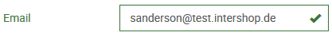
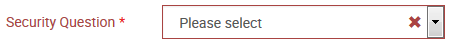
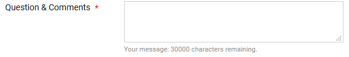
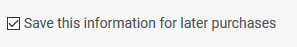
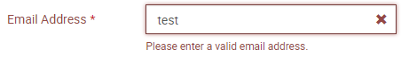

# Forms

## File and Naming Conventions

### Reusable Form Components

- File location: _app/shared/forms/components/\<form-name>_ or _app/shared/address-forms/components/\<form-name>_
- Name: _\<form-name>-form.component.ts_
- These forms can be used as (sub)forms on arbitrary pages, e.g., there are address forms on registration page, checkout and my account pages.

### Page Specific Form Components

- File location: _app/pages/\<page>/\<form-name>_
- Name: _\<form-name>-form.component.ts_
- These forms are only valid for a specific page. They are not reusable.
- Example: The credentials form on the registration page.

### Data Models

- File location for models and related classes: _app/core/models/\<object>_
- Model name: _\<object>.model.ts_
- Mapper file name: _\<object>.mapper.ts_
- Data (interface) file name: _\<object>.interface.ts_

### Services

- File location for global services: _core/services/\<object>_
- File location for module specific services: _\<module>/services/\<object>_
- Name: _\<object>.service.ts_

Usually, there should be no form specific data models. If forms are related to persistent data, use/create generic data models for your forms, e.g., there should be only one data model for addresses. Each model has its own service class(es). In this class there are methods concerning the data model, e.g., updateAddress (address: Address)

### Extensions

If functionality is implemented as an extension, the form models and services can be found in the extensions folder:

- forms: _app/extensions/\<module>/pages/\<page>/\<form-name>_
- models: _app/extensions/\<module>/models/\<object>_
- services: _app/extensions/\<module>/services/\<object>_

## Form Behavior

- Labels of required form controls have to be marked with a red asterisk.
- After a form control is validated:
  - Its label gets green and a checked icon is displayed at the end of the control in case the input value is valid.
  - Its label gets red, an error icon is displayed at the end of the control and an error message is displayed below the control in case the input value is invalid.
- Form validation
  - If a form is shown, there should not be any validation error messages.
  - If a user starts to enter data in an input field, this field will be validated immediately.
  - If the user presses the submit button, all form controls of the form are validated; the submit button will be disabled as long as there is any unhandled form error.

## General Rules

### Usage of Template Driven Forms vs Reactive Forms

In general, you should use reactive forms for creating your forms. If a form is very simple (e.g. only one form input field without any special validation rules), it is also possible to use template driven forms as an exception.

### Validators

For the validation of the form input fields you can use Angular's [Build-in Validators](https://angular.io/api/forms/Validators).

Additionally, the package [ng2-validation](https://www.npmjs.com/package/ng2-validation) is available. It provides further validators.

If there is a need for special custom validators, use class _app/shared/forms/validators/special-validators_ to write your own custom validators.

### Keep Templates and Type Script Code Simple

Whenever possible, move logic from the template to the type script.

Use predefined form control components and directives to get general functionality like displaying control validation status, validation error messages and so on, see the following section.

## How to Build a Form

### Build a Form

- Build a page component which is responsible for getting and sending data using facades.
- Build a form component which holds the form.
- Use either predefined form control components (see below) to build your form or `ish-form-control-feedback` component to display error messages and the validation icons and `ishShowFormFeedback` directive on the form-group elements in order to color labels and controls according to their validation status.
- In both cases the parameter `errorMessages` should be a key value pair of a possible validator that causes the error and its localisation key/localized string, e.g.:  
   { `'required':'account.login.email.error.required'` , `'email':'account.login.email.error.invalid'` }
- Take care of disabling the form submit button in case the user submits an invalid form (see example below).

### Example

**login-form.html**

```html
<form name="LoginUserForm" [formGroup]="loginForm" class="form-horizontal bv-form" (ngSubmit)="onSignin()">
  <ish-input
    [form]="loginForm"
    [controlName]="'userName'"
    [type]="'email'"
    [label]="'Email'"
    [labelClass]="'col-sm-3'"
    [inputClass]="'col-sm-6'"
    [markRequiredLabel]="'off'"
    [errorMessages]="{'required':'account.login.email.error.required' ,'email':'account.login.email.error.invalid'}"
  ></ish-input>
  <ish-input
    [form]="loginForm"
    [controlName]="'password'"
    [type]="'password'"
    [label]="'Password'"
    [labelClass]="'col-sm-3'"
    [inputClass]="'col-sm-6'"
    [markRequiredLabel]="'off'"
    [errorMessages]="{'required':'account.login.password.error.required' ,'pattern':'account.login.password.error.invalid'}"
  ></ish-input>
  <button type="submit" value="Login" name="login" class="btn btn-primary" [ disabled ]="formDisabled">
    {{'account.signin.button.label' | translate}}
  </button>
</form>
```

**login-form.ts**

```typescript
import  { FormBuilder, FormGroup, Validators }  from   '@angular/forms' ;
import  { CustomValidators }  from   'ng2-validation' ;
import { FormUtilsService } from '../../../../core/services/utils/form-utils.service';
...

constructor  (
  private  formBuilder :  FormBuilder,
  private formUtils: FormUtilsService ) {}
...

ngOnInit() {
   this .loginForm  =   this .formBuilder.group({
       userName: [ '' , [Validators.required, CustomValidators.email]],
       password: [ '' , Validators.required]
    });
}

onSignin(userCredentials) {
 if (this.form.invalid) {
   this.submitted = true;
  this.formUtils.markAsDirtyRecursive(this.form);
  return;
 }
this.create.emit(this.form.value);

}


cancelForm() {
   this.cancel.emit();
 }
```

## Predefined Components / Directives / Services

| Component/Directive                       | Example                                                                                                                                                                                                                                                                                                                                 | Description                                                                                                                                                                                             |
| ----------------------------------------- | --------------------------------------------------------------------------------------------------------------------------------------------------------------------------------------------------------------------------------------------------------------------------------------------------------------------------------------- | ------------------------------------------------------------------------------------------------------------------------------------------------------------------------------------------------------- |
| **ishShowFormFeedback** (Directive)       | \<div class="form-group has-feedback" [formGroup]="form" [ishShowFormFeedback]="formControl">...\</div>                                                                                                                                                                                                                                 | Directive ishShowFormFeedback Can be used to color labels and form controls in dependence of the validation status of the related form control Should be used at the form-group element                 |
| **ish-input** (Component)                 |  &nbsp; \<ish-input [form]="loginForm" controlName="userName" type="email" label="account.login.email.label" labelClass="col-sm-3" inputClass="col-sm-6" markRequiredLabel="off" [errorMessages]="{'required':'account.login.email.error.required','email':'account.login.email.error.invalid'}">\</ish-input> | **Input form control** for Text input fields, Email input fields, Password input fields, Number input fields                                                                                            |
| **ish-select** (Component)                |  \<ish-select controlName="securityQuestion" [form]="credentialsForm" label="Security Question" [options]="securityQuestionOptions" showEmptyOption="true" [errorMessages]=" {'required':'account.login.email.error.required'}">\</ish-select>                                                                 | **Select form control** 'options' should implement interface SelectOption                                                                                                                               |
| **ish-textarea** (Component)              |  \<ish-textarea controlName="comments" [form]="contactForm" label="helpdesk.contactus.comments.label" maxlength="30000" rows="10" [errorMessages]="{ required: 'helpdesk.contactus.comments.error' }">\</ish-textarea>                                                                                   | **Textarea form control**                                                                                                                                                                               |
| **ish-checkbox** (Component)              |  \<ish-checkbox controlName="saveForLater" [form]="paymentForm" label="checkout.save_edit.checkbox.label">\</ish-checkbox>                                                                                                                                                                                     | **Checkbox form control**                                                                                                                                                                               |
| **ish-form-control-feedback** (Component) |  <ish-form-control-feedback [messages]="errorMessages" [control]="formControl"></ish-form-control-feedback>                                                                                                                                                                                           | **form control feedback component** To display error messages To display validation status icon of the related form control NOTE: Use this component only if you cannot use one of the components above |
| **form-utils** (Service)                  | Methods: markAsDirtyRecursive(formGroup: FormGroup) updateValidatorsByDataLength(control: AbstractControl,array: any[],validators: ValidatorFn / ValidatorFn[] = Validators.required,async = false)                                                                                                                                     |                                                                                                                                                                                                         | Service for form related tasks |

## Error Handling of Server Side Error Messages

Server side errors should be saved in the ngrx store. Please make sure they are also removed if they are obsolete.

Errors should be read by appropriate facade methods and can be displayed by the error-component.

**account-profile-user.component.ts**

```typescript
userError$: Observable<HttpErrorResponse>;

ngOnInit() {
 ...
 this.userError$ = this.accountFacade.userError$;
 }
```

**account-profile-user.component.html**

```html
<!-- Error message -->
<ish-error-message [error]="userError$ | async"></ish-error-message>
```

## The Address Form as an Example of a Reusable Form

If you want to embed a reusable form onto your page or if you want to combine several forms into one big form like the registration form, you always have to use reactive forms.

### How to Use the address-form Component

The following steps describe how to use the address-form component on your form (see also the example below):

Container component:

1. Get all necessary data (countries, regions, titles etc.) and pass it to the form component.
2. React on country changes by getting country specific data like regions and titles.

Form component:

1. Place the address-form component on the html part of your form component.
2. onInit: Add a (sub) formGroup for your address to your form using the `getFactory` method of the AddressFormService.
3. Implement the onCountryChange behavior to switch the address formGroup according to the country specific form controls and emit this to the container.
4. React on region changes: Update validator for "state" control according to regions.

### How to Create a New Country Specific Form

1. Create a new country-specific address-form component under _shared/forms/address-forms/forms/address-form-<countrycode>._
2. Create the related factory class under _shared/forms/address-forms/forms/address-form-<countrycode>._
3. Add your new component in _shared/forms/address-forms/forms/address-form.html_ under the `ngSwitch` statement.
4. Register your new component in _shared/forms/address-forms/forms/index.ts_ under `components` and `factoryProviders`.

## Dynamic Forms

Form creation is also possible dynamically based on a (json) definition using the library [formly](https://formly.dev/).

This is currently done to create payment parameter forms depending on the payment method (e.g. a credit card form). The form definition is obtained from the REST interface in this case.

The following input types are supported by now:

**forms-dynamic.module.ts**

```typescript
FormlyModule.forRoot({
      types: [
        { name: 'input', component: InputDynamicComponent },
        { name: 'select', component: SelectDynamicComponent },
      ],
    }),
```

The InputDynamicComponent and the SelectDynamicComponent map the input of the Type 'FieldType' (formly) to the form predefined control components (see also table above).
