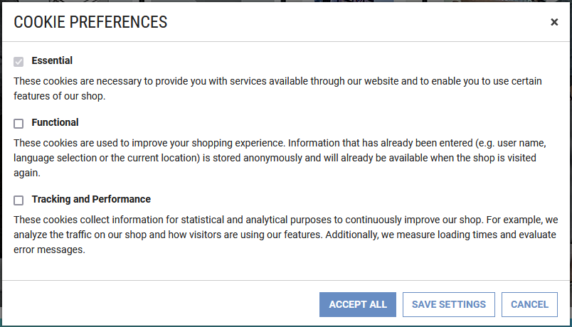
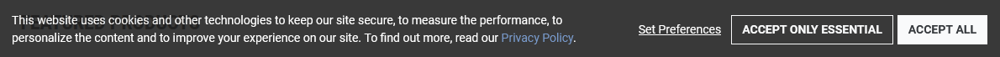

<!--
kb_guide
kb_pwa
kb_everyone
kb_sync_latest_only
-->

# Cookie Consent

The Intershop PWA features its own cookie consent implementation that allows to configure the different options a shop user should be presented with when deciding which types of cookies the user wants to allow and which not.
Based on this decision, a cookie is written that stores the user's cookie consent settings.
These settings can then be used to enable or disable certain features that rely on cookies or other means of collecting user information.

## Configure Cookie Consent Options

Configuration of the cookie consent functionality is done via the project's application environment configuration.
A default is set in the `ENVIRONMENT_DEFAULTS` in the `environment.model.ts`.

```javascript
cookieConsentOptions: {
  options: {
    required: {
      name: 'cookie.consent.option.required.name',
      description: 'cookie.consent.option.required.description',
      required: true,
    },
    functional: {
      name: 'cookie.consent.option.functional.name',
      description: 'cookie.consent.option.functional.description',
    },
    tracking: {
      name: 'cookie.consent.option.tracking.name',
      description: 'cookie.consent.option.tracking.description',
    },
  },
  allowedCookies: ['apiToken', 'cookieConsent', 'preferredLocale'],
},
```

The `options` array configures the presented options in the _Cookie Preferences_ modal.

- The option `id` is the value that will be stored in the user's `cookieConsent` settings.
- The `name` makes up the checkbox label name, usually given as localization key.
- The `description` contains the additional option description, usually given as localization key.
- With the `required` flag, an option can be marked as not non-selectable.
  In this way, the user can be informed that necessary cookies are always set without explicit consent of the user.

The following screenshot is the rendered representation of the default cookie consent options configuration:


The `allowedCookies` configuration can be used to identify a list of [required cookies](#pwa-required-cookies) that are not controlled by cookie consent settings and are not deleted when cookie preferences are changed.
All other cookies will be deleted when the user changes the settings.
The enabled options cookies would be rewritten if required.
The `cookieConsent` cookie must always be set as allowed cookie.

## Control Cookie Consent Banner Display

To request the user's cookie consent and to inform the user about the usage of cookies in the application, there is a banner at the bottom of the screen:



This banner is displayed if the user has not yet accepted any of the cookie options, meaning the user does not have the `cookieConsent` cookie set in their browser.

Once the user confirms the cookie consent, the cookie is set and the application will reload with the new cookie preferences set and without displaying the cookie banner again.
When the cookie expires, the cookie banner will be displayed again.

When setting the `cookieConsent` cookie in addition to the selected options, the currently configured cookie consent `version` is stored in the cookie as well.
This version flag allows to re-enforce the display of the cookie consent banner for users who previously gave their consent for a lower cookie consent version number.
This might be necessary if the linked _Privacy Policy_ was updated or if additional or changed cookie consent options must be displayed and accepted.

The cookie consent version can be set in the source code by changing the application environment's configuration default `cookieConsentVersion` value in the `ENVIRONMENT_DEFAULTS` in the `environment.model.ts`, or by setting a different value in any specific `environment.ts`.

```json
cookieConsentVersion: 1,
```

The cookie consent version can also be set via the environment variable `COOKIE_CONSENT_VERSION` of the deployment.
This way a re-required cookie consent banner display can be controlled independent from the PWA source code just with a deployment setting.

## Cookie Consent Settings

The user's accepted cookie consent settings are stored to a required and allowed cookie named `cookieConsent` (see the [`CookiesService setCookiesConsentFor` method](../../src/app/core/utils/cookies/cookies.service.ts)).
Its value contains the enabled cookie consent options and the cookie consent version that was accepted as an encoded JSON object.

```json
{ "enabledOptions": ["required", "functional", "tracking"], "version": "1" }
```

## Enable PWA Functionality Dependent on Cookie Consent Settings

To enable certain functionalities based on a given cookie consent of the user, e.g. because they require setting specific cookies or collect user data, the PWA's `CookiesService` provides a method [`cookieConsentFor()`](../../src/app/core/utils/cookies/cookies.service.ts) to check for the required cookie consent.

The default implementation of the Intershop PWA currently requires an enabled `tracking` option for the cookie consent to start the [Google Tag Manager](https://support.google.com/tagmanager) integration and the [Sentry](https://sentry.io) application monitoring and error tracking.
In addition, these features must be enabled in the deployment via feature toggle.

## Displaying the Cookie Consent Options

To display the cookie consent options of the shop and the current settings of the current user, a special `/cookies` route is implemented in the PWA that will open the cookie preferences modal.
This route can be linked to from anywhere within the application.

## PWA Required Cookies

| Name            | Expiration | Provider      | Description                                                       | Category    |
| --------------- | ---------- | ------------- | ----------------------------------------------------------------- | ----------- |
| apiToken        | 1 year     | Intershop PWA | The API token used by the Intershop Commerce Management REST API. | First Party |
| cookieConsent   | 1 year     | Intershop PWA | Saves the user's cookie consent settings.                         | First Party |
| preferredLocale | 1 year     | Intershop PWA | Saves the user's language selection.                              | First Party |

## Disabling the Integrated Cookie Consent Handling

To disable the integrated cookie consent handling implementation, remove the following line from [`app.component.html`](../../src/app/app.component.html):

```
<ish-cookies-banner></ish-cookies-banner>
```

With this change, the integrated cookie consent handling will no longer check whether the banner should be displayed or not and the `cookieConsent` cookie will no longer be written.

In addition, the `cookies` route should be removed from [`app-routing.module.ts`](../../src/app/pages/app-routing.module.ts):

```
{ path: 'cookies', loadChildren: () => import('./cookies/cookies-page.module').then(m => m.CookiesPageModule) },
```

> [!IMPORTANT]
> When disabling the integrated cookie consent handling, the `cookieConsentFor()` check will no longer work as intended and must be adapted to suit the alternative cookie consent implementation used.
> To still use the internal `cookieConsentFor()` checks of the current implementation, it may be possible to have the alternative cookie consent implementation store the same `"enabledOptions"` information.

To completely remove the UI of the internal cookie consent implementation, remove the `src\app\pages\cookies` and `src\app\shell\application\cookies-banner` folders.
