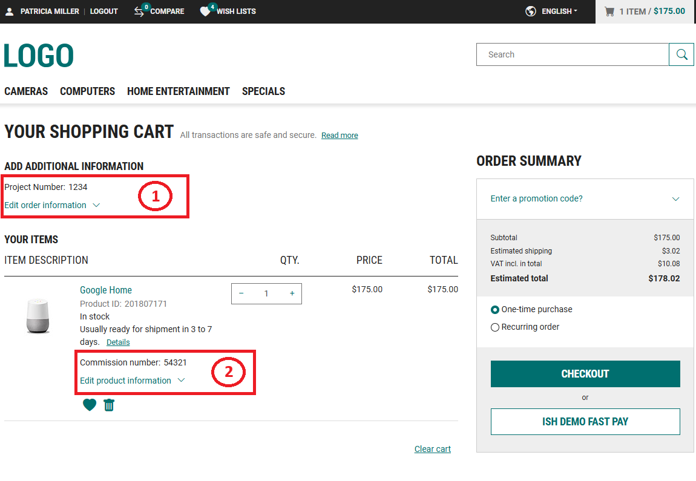
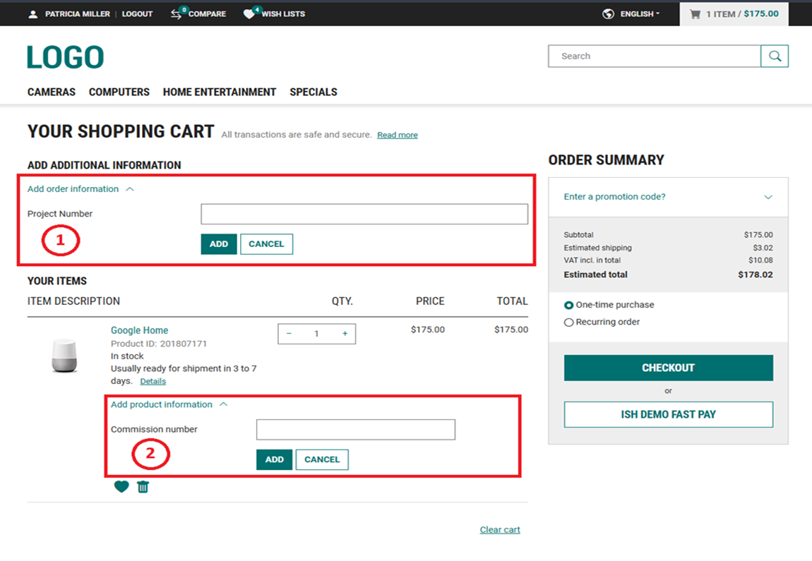

<!--
kb_guide
kb_pwa
kb_everyone
kb_sync_latest_only
-->

# Custom Fields

- [Concept](#concept)
  - [Scopes and Editability](#scopes-and-editability)
- [Basic Components](#basic-components)
- [Where Custom Fields Are Displayed](#where-custom-fields-are-displayed)
  - [Basket-Level](#basket-level)
  - [Line-Item-Level](#line-item-level)
  - [Order-Level](#order-level)
- [How Custom Fields Are Sent to the Backend](#how-custom-fields-are-sent-to-the-backend)
- [Further References](#further-references)

## Concept

Custom fields are a generic mechanism that allows adding user-editable or read-only attributes to different objects like baskets, basket line items, orders or order line items.
The fields are defined and configured in the Intershop Commerce Management including their name, scope assignment, and visibility/editability property.
For more information see [Concept - Pre-integrated Custom Fields (Backend)].
The PWA then reads these definitions at runtime via the `GET /configurations` endpoint, stores this information in the `server-config` state and renders them dynamically according the applied configuration.

### Scopes and Editability

The scopes and properties relating to editability and visibility determine where and in what format the custom fields are integrated into the PWA.
Each custom field definition is assigned to one or more **scopes**.
Per scope, the backend specifies:

| Flag         | Meaning                                                                                     |
| ------------ | ------------------------------------------------------------------------------------------- |
| `isVisible`  | Field is shown in the storefront. Fields with `isVisible: false` are filtered out entirely. |
| `isEditable` | Field can be edited by the user. If `false`, the field is displayed read-only.              |

Supported scopes: `Basket`, `BasketLineItem`, `Order`, `OrderLineItem`.

## Basic Components

There are two basic components to cover the `isEditable` flag.
In case the flag is true, the custom field is editable the shared component [CustomFieldsFormlyComponent] should be used.
This component provides the form to edit this custom field as well the showing the value of the custom field.
In case the custom field is not editable only the value of the custom field should be shown.
For the read only mode the shared [CustomFieldsViewComponent] component is provided.

## Where Custom Fields Are Displayed

### Basket-Level

Custom fields with scope **`Basket`** will display in the `ShoppingBasketComponent`.
The containing sub component [BasketCustomFieldsComponent] managed the handling of the custom fields.
This component shows a collapsible form (via [CustomFieldsFormlyComponent]) to add/edit values, and a read-only view (via [CustomFieldsViewComponent]) when collapsed.
The `BasketCustomFieldsComponent` is also integrated into the `CheckoutReviewComponent` and `CheckoutReceiptComponent`.

### Line-Item-Level

Custom fields with scope **`BasketLineItem`** or **`OrderLineItem`** will display in the `LineItemInformationEditComponent` sub component of `LineItemListComponent`.
The `LineItemInformationEditComponent`contains the [LineItemCustomFieldsComponent] which shows read-only values; if the parent passes `editable = true`, an edit button with a formly form is rendered.
The `LineItemListComponent` and therefore also their sub-components are used in further components e.g. `CheckoutReviewComponent` and `CheckoutReceiptComponent` as well in my account components e.g. `AccountOrderComponent`, `AccountRecurringOrderPageComponent` or `RequisitionDetailPageComponent`.

<a href="editable_custom_fields_view.png" target="_blank"></a>
<a href="editable_custom_fields_form.png" target="_blank"></a>

> Section marked with 1 shows the [BasketCustomFieldsComponent] and section marked with 2 shows the [LineItemCustomFieldsComponent]

### Order-Level

For displaying custom fields with scope **`Order`** the component [CustomFieldsViewComponent] is used.
This component is wired to the corresponding components for showing order data e.g. `AccountOrderComponent`, `AccountRecurringOrderPageComponent` or `RequisitionDetailPageComponent`.

## How Custom Fields Are Sent to the Backend

### Basket custom fields

1. User submits the form → `checkoutFacade.setBasketCustomFields(form.value)`
2. The [setBasketCustomFields$] effect transforms values using `CustomFieldMapper.toData()` and dispatches `updateBasket()`
3. A `PATCH` request is sent to the basket endpoint with body:

```json
{ "customFields": [{ "name": "deliveryNote", "value": "my note", "type": "String" }] }
```

### Line-item custom fields

1. User submits the line-item form → component emits `updateItem` with `{ itemId, customFields }`
2. The [updateBasketItem$] effect transforms values using `CustomFieldMapper.toData()` and calls `basketItemsService.updateBasketItem()`
3. A `PATCH` request is sent to the line-item endpoint with the same `customFields` format.

## Further References

- [Concept - Pre-integrated Custom Fields (Backend)]
- [Cookbook - Pre-integrated Custom Fields (Backend)](https://knowledge.intershop.com/kb/index.php/Display/3P1103)

[Concept - Pre-integrated Custom Fields (Backend)]: https://knowledge.intershop.com/kb/index.php/Display/3M1102
[CustomFieldsViewComponent]: ../../src/app/shared/components/custom-fields/custom-fields-view/custom-fields-view.component.ts
[CustomFieldsFormlyComponent]: ../../src/app/shared/components/custom-fields/custom-fields-formly/custom-fields-formly.component.ts
[BasketCustomFieldsComponent]: ../../src/app/shared/components/basket/basket-custom-fields/basket-custom-fields.component.ts
[LineItemCustomFieldsComponent]: ../../src/app/shared/components/line-item/line-item-custom-fields/line-item-custom-fields.component.ts
[setBasketCustomFields$]: ../../src/app/core/store/customer/basket/basket.effects.ts
[updateBasketItem$]: ../../src/app/core/store/customer/basket/basket-items.effects.ts
