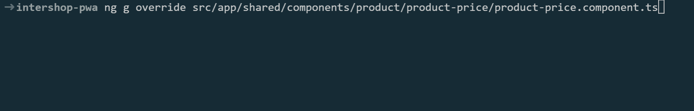

<!--
kb_guide
kb_pwa
kb_everyone
kb_sync_latest_only
-->

# Customization Guide

When customizing the PWA, always keep in mind that you probably want to upgrade from time to time and will have to merge incoming changes into your codebase.
We therefore suggest that you do not edit existing files all too much and keep them as intact as possible.
In this document we provide a couple of rules that you should follow.
Generally speaking:

> Keep modifications on existing files as minimal as possible!

It can be tempting to always modify existing templates, component and style files inline when doing customization.
However, when merging incoming upgrades the number of merge conflicts can possibly be large.
So if you want to upgrade to new PWA versions later, stick to the following recommendations.

## Setup an Intershop PWA-based Project

When initially setting up an Intershop PWA-based project it is not advisable to clone the complete GitHub repository of the Intershop PWA.
All that is initially needed is the `master` branch that includes the released versions of the PWA.
This can be achieved with the following Git command.

```
git clone --single-branch --branch master --origin intershop https://github.com/intershop/intershop-pwa.git project-pwa
```

This command clones only the `master` branch from the GitHub repository of the Intershop PWA with the remote name `intershop` (not `origin` that will be needed later on for the projects own remote Git repository) into a folder `project-pwa` (instead of `intershop-pwa`).

Based on this initial version of the Intershop PWA (the latest release), any project customizations can be started.

## Start Customization

The PWA uses themes which include theme specific

- features and configurations
- overrides for certain file types (HTML, component styles and TypeScript)
- styles and static assets

To start customizing, **set a default theme** for your customization with the script

```bash
node schematics/customization/add --default <theme-prefix>
```

It will:

- add an Angular theme configuration in `angular.json` which is used to configure your individual theme. This **default** theme will be used instead of the existing B2B and B2C themes. It is possible to configure and run multiple themes next to each other, see [Guide - Multiple Themes](./multiple-themes.md)).
- add the theme-prefix as the active theme in `package.json` and replace all active themes (if `--default` is used)
- add the theme-prefix specific file `environment.<theme-prefix>.ts` which should be used for further theme configuration
- add initial style files for styling customization under `src/styles/themes/<theme-prefix>`
- add the theme-prefix to the override schematic `schematics/src/helpers/override/schema.json`
- change the project prefix for new Angular artifacts from `ish` to `custom`
- customize ESLint in `.eslintrc.json` to support your new theme files (specifically, the `project-structure` rule)

> **NOTE:** If only one theme is active, PM2 will run the theme-specific SSR process in cluster mode on the default port (see [Building Multiple Themes](../guides/ssr-startup.md#building-multiple-themes)).

After that we recommend to additionally use the prefix `custom` in every component to further help identifying customized components.

```bash
$ ng g c shared/components/basket/custom-basket-display
CREATE src/app/shared/components/basket/custom-basket-display/custom-basket-display.component.ts (275 bytes)
...
```

## Specific Concerns

### Components

When **adding new functionality**, it is better to encapsulate it in **new components** that handle every aspect of the customization and just **use them in existing templates**.
That way the modifications on existing code are most often kept to a single line change only.

When **heavily customizing** existing components it is better to **copy components** and change all references.
If 20 % of the component has to be changed, it is already a good idea to duplicate it.
That way incoming changes will not affect your customizations.
Typical hot-spots where copying is a good idea are header-related or product-detail-page related customizations.

#### Theme Specific Overrides

The [customized webpack build](./optimizations.md) supports replacing any file with an environment suffix in front of the file extension.
If you for example want to customize the template `product-detail.component.html`, put your customized content in the parallel file `product-detail.component.theme.html` and run a build with `--configuration=theme`.
Then this overridden component template will be swapped in.

This also works for multiple configurations: `product-detail.component.foo.bar.baz.html` will be active for configurations `foo`, `bar` and `baz`, but not for `foobar`.

There is also a virtual theme `all` that can be used to always override a specific file.
However, the `all` theme cannot be used in combination with other themes.
If a theme specific override is available next to an override for `all`, the specific override will be chosen.

As an example, imagine the following files/overrides exist:

```txt
  my.component.html
  my.component.all.html
  my.component.foo.html
  my.component.bar.baz.html
```

- In a build for theme `foo`, the file `my.component.foo.html` will be swapped in.
- In a build for theme `bar`, the file `my.component.bar.baz.html` will be swapped in.
- In a build for theme `foobar`, the file `my.component.all.html` will be swapped in.
- The file `my.component.html` won't be used for any builds.

##### Schematic Support

You can use the `override` schematic to introduce custom theme overrides:



### Existing Features

When you want to **disable code** provided by Intershop, it is better to **comment it out instead of deleting** it.
This allows Git to merge changes more predictably since original and incoming passages are still similar to each other.
Commenting out should be done in the form of block comments starting a line above and ending in an additional line below the code.
Use `<!--` and `-->` for HTML and `/*` and `*/` for SCSS and TypeScript.

Some of the provided components supply **configuration parameters** which can be used to handle customization in an easy way (i.e. disabling features or switching between them).

### New Features

When adding new independent features to the PWA, it might be a good idea to **add an extension** first.
Use the provided schematics `ng g extension <name>` to scaffold the extension.
Adding all related pages, components, models and services here is less intrusive than adding them to the existing folder structure.
Add additional artifacts to extensions by supplying the `--extension` flag to schematics calls.

### Data

When **adding new fields** to PWA data models, add them to interfaces and **map them as early as possible** in mapper classes to model classes.
That way the data can be readily used on templates.
Improving and parsing improper data too late could lead to more modifications on components and templates which will be harder to upgrade later on.

### NgRx

Adding **new data** to the state should always almost exclusively be done by adding new stores in **store groups**.
Add one with `ng g store-group <group>` and then add consecutive stores with `ng g store --feature <group> <store>`.
Keep modifications to the existing store as little as possible.
As NgRx is loosely coupled by nature, you can deactivate effects by simply commenting out the `@Effect` decorator.

### Testing

When modifying components it is most likely that related test cases will fail.
If possible, use the Jest update feature **update snapshots** when adapting test cases.
When you upgrade the PWA to a new version, those snapshots will most likely have merge conflicts in them.
Here you can just accept either modification and update the test snapshots.

### Styling

Changing the styling by applying changes to SCSS files should be done in the custom theme folder `src/styles/themes/<theme-prefix>`.
This folder is created when adding a new theme, see [Start Customization](../guides/customizations.md#start-customization).
There are two approaches to apply a theme specific styling:

1. Copy only the `*.scss` files you need to change to your themes folder and adjust the file references. All files which are not overwritten in your theme will be taken from the standard and all changes and bugfixes in these files when migrating the PWA will be applied and used in your project.
2. Copy the complete set of standard `*.scss` files to your themes folder and adjust the file references. All standard changes and bugfixes to `*.scss` files will not be applied to your theme during a PWA migration.

Just putting a theme override file next to the original file in the `src/styles` folder will not lead to the expected results.
The lookup starts with the file `style.scss` in the theme specific folder.

> **Note:** You should
>
> - not change global `*.scss` files in `src/styles` and only apply style changes in your theme folder by copying files into the this folder and adjusting file references
> - not delete the standard theme folders to prevent merge conflicts when migrating the PWA (changes in standard files but deleted in your project).

When styling is done on component level, all styling is encapsulated to exactly this component (default behavior).
On component level, theme-specific overrides for `.scss` files work as expected.

You can re-use variables from the global styling on component level by importing only the styling file that defines the theme variables, e.g.

```
@import 'variables';
```

> **Note:** Be aware that Visual Studio Code will not resolve all import references correctly but it works in the build PWA version anyways.

> **Note:** For bundled styles optimization PurgeCSS is used. Please read [the additional documentation](./optimizations.md#purgecss) regarding the usage and configuration of PurgeCSS in the Intershop PWA.

### Static Assets

To add static assets (images, favicon, manifest file), create a theme specific folder in `src/assets/themes/<theme-prefix>` and adjust the theme specific references in the `*.scss` files accordingly.

The `index.html` does not support theme specific overrides, see [Theme Specific Overrides](../guides/customizations.md#theme-specific-overrides).
For this file, any theme specific differences are handled via [theme.service.ts](../../src/app/core/utils/theme/theme.service.ts).

### Dependencies

When updating dependencies and resolving conflicts inside of `package-lock.json`, always **accept Intershop's changes** first.
After that run `npm install` to regenerate the file.

### Cypress Tests

We currently do not support specific adaptions for customizing Cypress tests in projects.
In theory the customized PWA project can re-use our Page Objects without much adaptions if the customized PWA also uses the same selectors for CSS classes and data-testing-ids.

Specs should be copied and adapted for the project to use correct demo data.
When executing tests, the test itself requires an appropriate demo server to be launched before the run.
We currently use patterns in the test name to determine the channel for which the test can be run.
E.g. `login-user.b2b.b2c.e2e-spec.ts` can be run on with the inSPIRED B2C and B2B channels.
The same system can be adopted for customization projects.

## Import Changes from New PWA Release (Migration)

Importing changes of new releases is done with Git tooling.
If you stick to the guidelines in this chapter, the process of updating should run without major problems.
Also remember to use `npm install` after importing a change that modified the `package.json` and `package-lock.json` and run tests and linting in the process.

Reading through the [migrations.md](./migrations.md) and the [CHANGELOG.md](../../CHANGELOG.md) - here especially the 'Breaking Changes' section - should be the first step before any migration.

The first step for any migration is to add the Intershop PWA GitHub repository as an additional remote if this is not already the case.

```
git remote add intershop https://github.com/intershop/intershop-pwa.git
```

For importing changes from the current release, you can use different approaches:

### 1. Range Cherry Pick of New Release Commits

For the range `git cherry-pick` approach one needs to create a new branch based on the current project's main development branch, naming it, for example, `migration_to_1.1`.

```
git checkout -b migration_to_1.1
```

Now the Git commits of the new Intershop PWA release will be cherry picked into this migration branch.
For this, one needs to provide the wanted commit range which should be possible by using the Intershop PWA version tags, e.g. `1.0.0` to `1.1.0`.
If there are any problems with the tags, using the specific commit SHAs should always work.

```
git cherry-pick 1.0.0..1.1.0
```

Now each commit of the new Intershop PWA release is applied to the custom project context.
Thus, if any merge conflicts arise, this will be within the specific Intershop PWA commit context and should be mergeable with the information and diff provided for this commit in the GitHub repository.

After successfully going through the range cherry pick (with `git commit` and `git cherry-pick --continue` after each resolved merge conflict), an `npm install` will probably be required and one needs to check whether the project code still works as expected.
Starting the server or `npm run check` are good basic tests for that.

### 2. Rebase Commits of New Release

For the `git rebase --onto` approach one needs to create a new branch based on the release tag of the Intershop PWA one wants to migrate to, naming it, for example, `migration_to_1.1`.

```
git checkout -b migration_to_1.1 1.1.0
```

Now the branch with the Git commits of the new Intershop PWA release will be rebased onto the current project's main development branch.
For this, one needs to provide the branch name of the target branch to rebase onto.
In addition, a commit is needed where the current migration branch should be "cut off".
This is usually the current version tag of the Intershop PWA used currently in the custom project, e.g. `1.0.0`.
If there are any problems with the tag, using the specific commit SHAs should always work.

```
git rebase --onto develop 1.0.0
```

Now each commit of the new Intershop PWA release is applied to the custom project context.
Thus, if any merge conflicts arise, this will be within the specific Intershop PWA commit context and should be mergeable with the information and diff provided for this commit in the GitHub repository.

After successfully going through the rebase onto (with `git rebase --continue` after each resolved merge conflict), an `npm install` will probably be required and one needs to check whether the project code still works as expected.
Starting the server or `npm run check` are good basic tests for that.

### 3. Merge the New Release in its Entirety

This is also a possible way to migrate your custom project to the latest version of the Intershop PWA, but you will have to resolve all potentially appearing conflicts at once and without the specific commit context.

Just add the Intershop PWA GitHub repository as a second remote in your project and `git merge` the release branch.

> Prior to 0.16.1 the entire git history changed completely.
> Please see [Merging 0.16.1 as 2nd upstream repository: "refusing to merge unrelated histories](https://github.com/intershop/intershop-pwa/issues/62) for suggestions on importing the new history.

## Hints

- The Intershop PWA project is configured to follow consistent formatting rules.
  For a better overview of relevant changes and less merge efforts it is advised to adhere to these rules during project development as well.
  For this, one needs to configure one's IDE accordingly.
  The fitting Visual Studio Code configuration is part of the project.
- The Intershop PWA project configures and contains a set of linting rules that also aim to ensure a consistent code style and are intended to prevent any coding patterns that are considered problematic.
  It is advised to follow these rules in customer projects as well.
  If some rules are actually unwanted in a project, it is best to disable these configurations but to keep all other checks intact and to address any violations.
- Keep the unit tests running and write new ones.
  This will also help ensuring not to break any existing functionality after a migration.
- `npm run check` should run through successfully on local development environments after a feature or bugfix or migration has finished.
  This check can be left to a CI pipeline as well but the task should be configured in a way that fits the requirements of the project.

# Further References

- [How to do projects with Intershop PWA 1.0 and Themes](https://www.youtube.com/watch?v=qz-ONgd9qdY)
