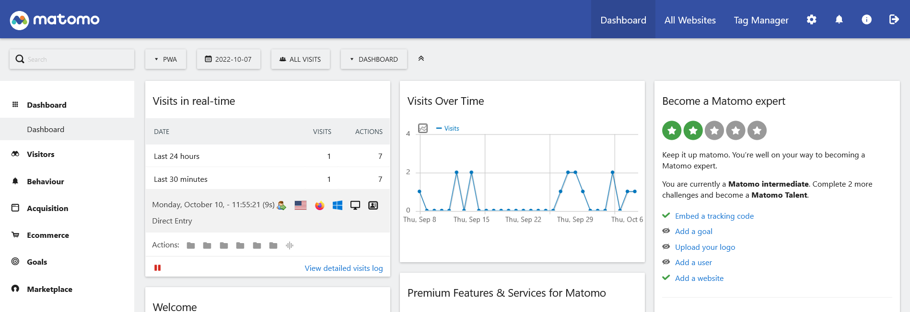
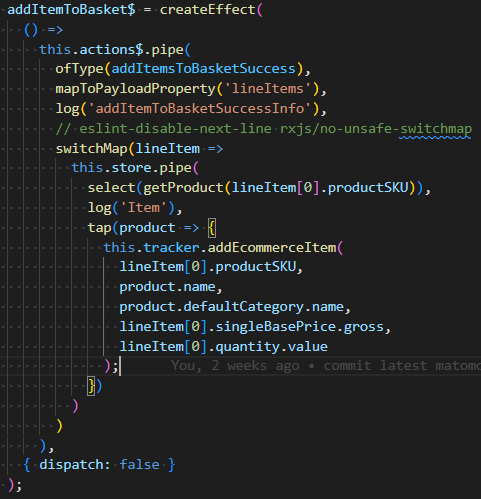
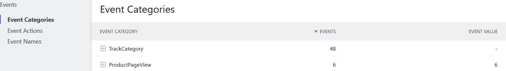
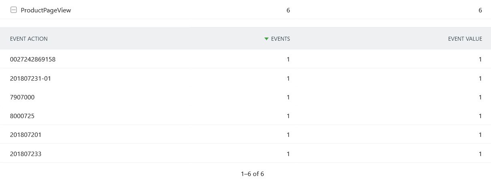

<!--
kb_guide
kb_pwa
kb_everyone
kb_sync_latest_only
-->
<!-- cSpell: disable -->

# **Matomo Tracking Feature**

Matomo provides an alternative tracking system to the well known Google Analytics.  
Since GA seems to struggle with the European and German data privacy policies the change to matomo might become important for businesses in the near future.  
This documentation provides information about the installation, integration, use and extension of matomo in [Intershop's PWA](https://github.com/intershop/intershop-pwa/blob/develop/docs/guides/getting-started.md)

## **Install Matomo**

Before you integrate matomo into the pwa. Here is a basic overview of the system and how it's set up:

- To get matomo up and running you basically have to set up two parts:
  1.  The matomo system (f.e. using the docker image) containing a MySQL Database for customer data and the web interface.
  2.  Matomo Tracker into the pwa to send data to the matomo system  
      The next section helps you to install matomo system

#### **Installation**

You can install the matomo system over their [website](https://matomo.org/faq/on-premise/installing-matomo/) or preferably using the official [docker image](https://hub.docker.com/_/matomo). Further information on the set up is provided on their website and the docker image.  
 After you installed and set up the matomo system, you can access the analytics dashboard on a browser.

When you open the matomo dashboard on your machine it should look like this:

Congratulations🎉! You set up the first part of matomo now you have to configure matomo in the pwa or if you have a version without matomo, integrate matomo into the pwa.

## Install Matomo Tracker into PWA

Because the pwa is based on the [Angular Framework](https://angular.io/), the [matomo client for Angular](https://github.com/EmmanuelRoux/ngx-matomo) documentation provides useful information on how to integrate the matomo client in the pwa for the first time.  
This step is not necessary when you use a pwa version with matomo already integrated.

## **Configuration**

## **Events**

Events are used to track special actions and behaviors like adding products to the basket or visiting a product page.  
For some frequently occurring events matomo provides methods that allow you to track more details.  
In general there are two important kind of ways to track events:

1. **Build-in Functions**  
   The logic of these function is already build. To send and process the data you only have to input the values as parameters into the function arguments.  
   Matomo provides a large variety of these functions, but only a fraction is regularly used.  
   For example:
   - addEcommerceItem --> add product to basket
   - updateEcommerceItem --> update the quantity in the basket
2. **Tag Manager**  
   With the [Tag Manager](https://matomo.org/guide/tag-manager/getting-started-with-tag-manager/) you can create your own events. Please visit the [Tag Manager](https://matomo.org/guide/tag-manager/getting-started-with-tag-manager/) documentation for detailed information.  
   The Tag Manager should be used if you want to track specific events that can't be tracked through the build-ins.  
   **Important: When it's possible, use the build-ins, they will offer the customer more details on the users of their webshop.**

## **Important Events**

Here are some common Events that are already implemented in the pwa:

1. _addEcommerceItem()_
   - user adds a product to his/her basket
   - user updates the quantity of a product that is already in his/her basket
2. _removeEcommerceItem()_
   - user deletes product from basket
3. _trackEcommerceCartUpdate()_
   - updates the total value of the basket after a product is removed or added
4. _setEcommerceView()_
   - set the current page as a product page -> track visits on products
   - always must be followed by _trackPageView()_
5. _trackEcommerceOrder()_
   - converts a basket into an order/sale
6. _trackEvent()_
   - tracks individual events

## **Create Events**

New events can be made inside the [matomo directory](../../src/app/extensions/matomo/matomo.effects.ts) by creating a new effect. When you develop effects in new files, you first have to add _MatomoTracker_ in the constructor.

Inside the effect, you can listen to an action like inside the [basket actions](../../src/app/core/store/customer/basket/basket.actions.ts). When the selected action is triggered the effect is executed as well. Every action provides useful data that you have to pass into the matomo method. Always check if the selected action provides enough data. See the Troubleshooting Documentation for more.  
A recommended Structure for your effects is shown in the next screenshot:  
  
Since most actions alone don't provide sufficient information on the product or the behavior, a _switchMap_ can be used to retrieve additional information from other methods. In the above example the _getProduct_ method was used to get the product name and category.

## **Track individual events**

This section focuses on how to track specific events that are not covered using the matomo build-ins.  
First you have to create a new effect like with the build-in methods. In the build in methods, you have to use the following function:

1. _trackEvent()_
   - Stores four variables
   - category -> the general description (f.e. ProductPageView or LargeOrder)
   - action -> specific info for a single case (f.e. the sku of the product)
   - name -> optional way to arrange the data
   - value -> holds a value that can be used in multiple ways (f.e. static 1 to increase the view count by one each call)

In the matomo dashboard you can filter the data by category, action and name:  

As you can see, matomo already shows you some of the parameters like category or value.  
For a detailed overview you can select a specific effect and get an enhanced view like this:  

