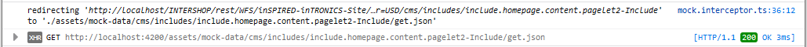

<!--
kb_guide
kb_pwa
kb_everyone
kb_sync_latest_only
-->

# Mocking REST API Calls

Sometimes during development it might be necessary to work with mocked data.
This is especially necessary when developing new features in parallel where backend and frontend are involved.
In the PWA we supply a mocking mechanism so the frontend team can start implementation with mocked data until the backend implementation is finished.

## Switching On Mocking

Mocking complete REST responses can be configured in _environment.ts_ for calls, that do not yet exist in the [REST API](http://developer.cloud.intershop.com) during development.
The property `apiMockPaths` is an array of regular expressions for paths.

The following configuration example will mock all CMS calls.

```
apiMockPaths: ['^cms/.*'],
```

## Supply Mocked Data

Mocked data is put in the folder _assets/mock-data/<path>_.
The path is the full path to the endpoint of the service without additional arguments.
The JSON response is put into a file called _get.json_ in the respective folder.

Example path to a homepage include mock file.

`src/assets/mock-data/cms/includes/include.homepage.content.pagelet2-Include/get.json`

Switching to mocked REST API calls is done by the `MockInterceptor` which reads the configuration and acts accordingly.

Mocked REST calls will be logged to the browser console similar to this example.


