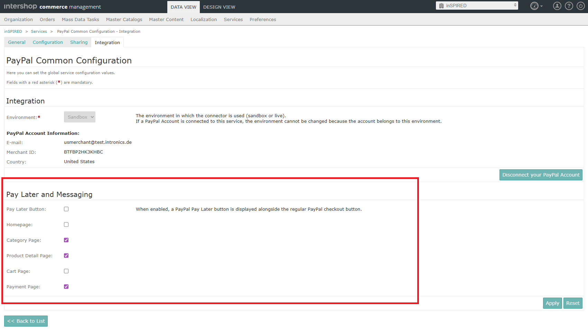

<!--
kb_guide
kb_pwa
kb_everyone
kb_sync_latest_only
-->

# PayPal Integration

- [Overview](#overview)
- [Prerequisites](#prerequisites)
- [Architecture](#architecture)
  - [Key Components](#key-components)
- [Adapter Types](#adapter-types)
  - [Buttons](#buttons)
  - [Messages](#messages)
  - [Card Fields](#card-fields)
- [Page Types](#page-types)
- [Styling Customization](#styling-customization)
  - [Pay Later Message Styling](#pay-later-message-styling)
- [Script Loading](#script-loading)
- [Pay Later Configuration](#pay-later-configuration)
- [Further References](#further-references)

## Overview

The PWA provides a component with the selector [`ish-payment-paypal`][payment-paypal.component.ts] that dynamically loads the PayPal SDK and renders the appropriate PayPal component based on the configured adapter type and page type.
It supports:

- **Buttons**: PayPal checkout buttons for standard payments
- **Messages**: Pay Later messaging for promotional content
- **CardFields**: Hosted card input fields for credit card payments

## Prerequisites

To use PayPal payment methods in the Intershop PWA, ensure that the following prerequisites are met:

1. The [Intershop PayPal Complete Payments Service Connector (PPCP Connector) version 3](https://knowledge.intershop.com/kb/go.php/a/ENFDEVDOC/pages/50477531143/Public+Release+Note+-+PayPal+Complete+Payments+Service+Connector+3) is installed and configured in Intershop Commerce Management.
2. The PayPal Common Configuration Service is configured in Intershop Commerce Management, and the onboarding process has been successfully completed.
3. The PayPal payment methods are activated and configured in Intershop Commerce Management.

## Architecture

The PayPal integration follows a modular architecture with clear separation of concerns:

```
src/app/core/utils/paypal/
├── adapters/
│   ├── paypal-buttons/           # PayPal Buttons adapter
│   ├── paypal-card-fields/        # PayPal Card Fields adapter
│   ├── paypal-messages/           # PayPal Pay Later Messages adapter
│   ├── paypal-adapters.builder.ts # Factory for creating adapters
│   └── paypal-adapters.styling.ts # Centralized styling configuration
├── paypal-config/
│   └── paypal-config.service.ts   # SDK loading and configuration
├── paypal-data-transfer/
│   └── paypal-data-transfer.service.ts # Data communication service
└── paypal-model/
    └── paypal.model.ts            # PayPal SDK interfaces
```

### Key Components

| Component                 | Location                                                 | Purpose                                                                                                                                 |
| ------------------------- | -------------------------------------------------------- | --------------------------------------------------------------------------------------------------------------------------------------- |
| `PaymentPaypalComponent`  | `src/app/shared/components/payment/payment-paypal/`      | Main Angular component for rendering PayPal elements                                                                                    |
| `PaypalAdaptersBuilder`   | `src/app/core/utils/paypal/adapters/`                    | Factory service that creates appropriate PayPal SDK adapters                                                                            |
| `PaypalConfigService`     | `src/app/core/utils/paypal/paypal-config/`               | Handles SDK script loading and URL construction                                                                                         |
| `PaypalCardFieldsAdapter` | `src/app/core/utils/paypal/adapters/paypal-card-fields/` | Representation of the PayPal SDK Card Fields object, responsible for rendering PayPal card fields and handling the associated callbacks |
| `PaypalButtonsAdapter`    | `src/app/core/utils/paypal/adapters/paypal-buttons/`     | Representation of the PayPal SDK Buttons object, responsible for rendering PayPal buttons and handling the associated callbacks         |
| `PaypalMessagesAdapter`   | `src/app/core/utils/paypal/adapters/paypal-messages/`    | Representation of the PayPal SDK Messages object, responsible for rendering PayPal Pay Later messages                                   |

## Adapter Types

The [`ish-payment-paypal`][payment-paypal.component.ts] component supports three different adapter types:

- Buttons
- Messages
- Card Fields

### Buttons

This adapter type is used to display PayPal checkout buttons for both standard and express payments.
The rendering is performed by the [`PayPalButtonsAdapter`][paypal-buttons.adapter.ts].
This component also provides the callback methods that are required by the PayPal JavaScript SDK Buttons API.
To use the `ish-payment-paypal` component with the Buttons adapter type, the `adapterType` input must be set to `Buttons`.
Additionally, the `pageType` is required to apply the appropriate SDK styling options.
It is also necessary to specify the `selectedPaymentMethod` so that the component can load the correct SDK for PayPal Buttons.

The following example shows how to integrate [`ish-payment-paypal`][payment-paypal.component.ts] for the corresponding adapter type `Buttons` into any component:

```html
<ish-payment-paypal [selectedPaymentMethod]="paypalPaymentMethod" [adapterType]="'Buttons'" [pageType]="'cart'" />
```

### Messages

This adapter type is used to display Pay Later messaging on various pages (home, category, product details, cart, checkout) based on the configuration in Intershop Commerce Management.
The rendering is performed by the [`PaypalMessagesAdapter`][paypal-messages.adapter.ts].
It is not necessary to set the `adapterType` input for messages, as it is the default type when no `adapterType` is provided.
However, the `pageType` input is required to apply the appropriate SDK styling options and to determine the visibility of Pay Later messages based on the configuration in Intershop Commerce Management.

The following example shows how to integrate [`ish-payment-paypal`][payment-paypal.component.ts] for the corresponding adapter type `Messages` into any component:

```html
<ish-payment-paypal [pageType]="'home'" />
```

### Card Fields

This adapter type is used to provide card input fields for direct credit/debit card payments (Advanced Card Payments).
The rendering is performed by the [`PaypalCardFieldsAdapter`][paypal-card-fields.adapter.ts].
This component also provides input validation, error handling, and the callback methods that are required by the PayPal JavaScript SDK Buttons API.

The following example shows how to integrate [`ish-payment-paypal`][payment-paypal.component.ts] for the corresponding adapter type `CardFields` into any component:

```html
<ish-payment-paypal [selectedPaymentMethod]="paymentMethod" [adapterType]="'CardFields'" [pageType]="'checkout'" />
```

## Page Types

The page type is required for various processes:

- **URL parameter**: The page types are required as script loader URL parameter `data-page-type`.
- **Styling**: Page types allow you to apply different styles to the component.
- **Pay Later handling**: The page type is also used to determine the visibility of Pay Later messages and buttons, which can be configured separately for each page type in Intershop Commerce Management.

## Styling Customization

This section explains how to style PayPal components in the Intershop PWA using the styling options provided by the [`PayPal JavaScript SDK`][PayPal JavaScript SDK Reference].

All styling configurations are located in [_paypal-adapters.styling.ts_][paypal-adapters.styling.ts].

### Pay Later Message Styling

The styling of PayPal messages depends on the page type.

```typescript
// This example shows the Pay Later messages styling for the component with pageType `home`.
export const PAYPAL_MESSAGE_STYLING = {
  home: { layout: 'flex', color: 'white-no-border', ratio: '20x1' },
  ...
};
```

## Script Loading

Depending on the configured adapter type, the PayPal integration dynamically loads the appropriate SDK instance with the necessary parameters (e.g., `client-id`, `merchant-id`, `currency`, `locale`, `intent`) via the [`PaypalConfigService`][paypal-config.service.ts].
Since the PayPal SDK URL parameters can differ for each payment method, the script URL is loaded with a unique namespace to avoid conflicts when multiple instances are required.
The namespace format is `PPCP_<payment_method_id>` for Buttons and Card Fields, and `PPCP_MESSAGES` for Pay Later Messages.

```typescript
// Namespace format: PPCP_<payment_method_id> or PPCP_MESSAGES
const paypalObject = window['PPCP_FAST_CHECKOUT'];
```

Loading is handled by the [`PaypalConfigService`][paypal-config.service.ts], which constructs the SDK URL with necessary parameters, and uses the [`ScriptLoaderService`][script-loader.service.ts] to load the script dynamically.

The [`ScriptLoaderService`][script-loader.service.ts] is a core utility service for dynamically loading external JavaScript files into the DOM.
It provides the following features:

- **Caching**: Prevents duplicate script loading by maintaining caches for loaded and currently loading scripts
- **Namespace support**: Uses `data-namespace` attributes as cache keys to handle scripts with dynamic URLs (e.g., PayPal SDK URLs that change with locale/currency)
- **Script attributes**: Supports `type`, `integrity`, `crossorigin`, and custom data attributes
- **Observable-based API**: Returns an `Observable<ScriptType>` for tracking load status

## Pay Later Configuration

The visibility of Pay Later messages or Pay Later buttons is controlled by the settings of the PayPal Common Configuration Service in Intershop Commerce Management.

<a target="_blank" href="paypal-pay-later.png"></a>

The PayPal configuration is retrieved from Intershop Commerce Management via the configurations endpoint.

The following example shows how to integrate the PayPal component on the product detail page to display Pay Later messages if Intershop Commerce Management settings are to be taken into account:

```html
<ng-container *ngIf="'payment.paypal.payLaterPreferences.PayLaterMessagingProductDetailsEnabled' | ishServerSetting">
  <ish-payment-paypal [pageType]="'product-details'" />
</ng-container>
```

## Further References

- [PayPal JavaScript SDK Reference](https://developer.paypal.com/sdk/js/)
- [PayPal Pay Later Messaging](https://developer.paypal.com/docs/checkout/pay-later/us/integrate/)
- [PayPal Advanced Card Payments](https://developer.paypal.com/docs/checkout/advanced/)
- [Intershop PayPal Complete Payments Service Connector (PPCP Connector) version 3](https://knowledge.intershop.com/kb/go.php/a/ENFDEVDOC/pages/50477531143/Public+Release+Note+-+PayPal+Complete+Payments+Service+Connector+3)

[payment-paypal.component.ts]: ../../src/app/shared/components/payment/payment-paypal/payment-paypal.component.ts
[paypal-adapters.styling.ts]: ../../src/app/core/utils/paypal/adapters/paypal-adapters.styling.ts
[paypal-config.service.ts]: ../../src/app/core/utils/paypal/paypal-config/paypal-config.service.ts
[script-loader.service.ts]: ../../src/app/core/utils/script-loader/script-loader.service.ts
[paypal-buttons.adapter.ts]: ../../src/app/core/utils/paypal/adapters/paypal-buttons/paypal-buttons.adapter.ts
[paypal-messages.adapter.ts]: ../../src/app/core/utils/paypal/adapters/paypal-messages/paypal-messages.adapter.ts
[paypal-card-fields.adapter.ts]: ../../src/app/core/utils/paypal/adapters/paypal-card-fields/paypal-card-fields.adapter.ts
[PayPal JavaScript SDK Reference]: https://developer.paypal.com/sdk/js/reference
