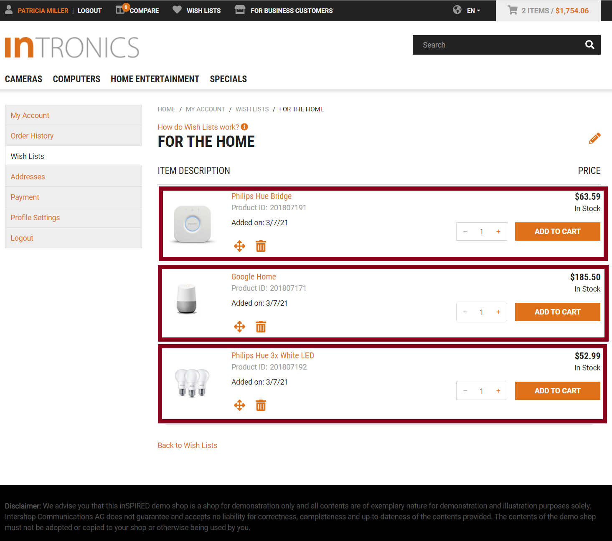

<!--
kb_guide
kb_pwa
kb_everyone
kb_sync_latest_only
-->

# Product Context

Product Contexts were introduced in PWA version [0.27](https://github.com/intershop/intershop-pwa/releases/tag/0.27.0).

## What is a Product Context?

Product Contexts provide an easy access to all data related to a single product.
The context itself stores the `sku` and (optional) `quantity` of the product and delegates all other information from the [State Management][state-management] in a simplified fashion.

The following screenshots provide examples where product contexts are used on some pages:

<div style="text-align: center;">
  <a target="_blank" href="product-context-recommendations.png"></a>
  <a target="_blank" href="product-context-listing.png"></a>
  <a target="_blank" href="product-context-bundle.png"></a>
  <a target="_blank" href="product-context-wishlists.png"></a>
</div>

For product pages, there is always one context, that spans all the content of the product page.
Nevertheless additional contexts for recommended products or bundled products can exist on the page.
For listings of any kind, individual contexts exist on the page for each product.
Product Contexts can also be linked to their parent contexts.

## How to introduce Product Context?

Other than normal facades, which are globally available and only one instance is available at runtime, context facades are provided using [`ElementInjector`](https://angular.io/guide/hierarchical-dependency-injection#elementinjector) and are therefore only available for elements enclosed in the document subtree, for which element introduced the context.

### by using [`ProductContextDirective`][src-product-context-directive]

The easiest way to start a product context is by using the [`ProductContextDirective`][src-product-context-directive] on templates:

```html
<ng-container *ngFor="let item of lineItems$ | async">
  <div class="..." ishProductContext [sku]="item.sku">
    <ish-product-name></ish-product-name>
  </div>
</ng-container>
```

What happens here?

- For each individual `item` from `lineItems$`, a product context is provided for embedded elements.
- Each individual context is associated with `item.sku` which also triggers fetching the product if it is not already available in the store.
- The `ish-product-name` component will render the product name.

This also portrays one of the main advantages of using this concept: No bubbling of product related data is necessary anymore.
The `ish-product-name` component is injecting the provided context and decides which data is used for rendering.

Have a look at [`ProductDetailComponent`](../../src/app/pages/product/product-detail/product-detail.component.html), which now only does layout and styling, whereas the context is provided by the outer [`ProductPageComponent`][src-product-page-component-ts].

### by providing [`ProductContextFacade`][src-product-context-facade]

There are cases, where it is not possible to use the directive.
For example, if the parent component does not have access to all required information, or the component has to introduce another context by itself.
In this case the [`ProductContextFacade`][src-product-context-facade] has to be added to the `providers` array of the [`@Component`](https://angular.io/api/core/Component) decorator.
Afterwards, the sku for the context has to be initialized:

```typescript
@Component({
  ...
  providers: [ProductContextFacade],
})
export class MyComponent implements OnInit {
  constructor(private context: ProductContextFacade) {}

  ngOnInit() {
    this.context.set('sku', () => this.staticValue);
    // or
    this.context.connect('sku', this.streamValue$);
  }
}
```

### by providing [`SelectedProductContextFacade`][src-selected-product-context-facade]

For pages, that are using the `:sku` route parameter, the Product Context can be introduced on the page level by using [`SelectedProductContextFacade`][src-selected-product-context-facade].

Have a look at [`ProductPageComponent`][src-product-page-component-ts] for an example.

## Retrieving Data from the Product Context

### inject [`ProductContextFacade`][src-product-context-facade]

The easiest way to interact with the context is by doing the same you would do with facades.
Inject the [`ProductContextFacade`][src-product-context-facade] into your components and relay data for the template into Observables and use the [async pipe](https://angular.io/guide/observables-in-angular#async-pipe) there:

```typescript
@Component({ ... })
export class MyComponent implements OnInit {
  available$: Observable<boolean>;

  constructor(private context: ProductContextFacade) {}

  ngOnInit() {
    this.available$ = this.context.select('product', 'available');
  }

  doSomething() {
    this.context.doSomething();
  }
}
```

```html
<ng-container *ngIf="available$ | async">...</ng-container>
```

### use [`ProductContextAccessDirective`][src-product-context-access-directive]

If access to the context is required on the template without injecting it into the component (i.e. when the component has multiple embedded contexts), the [`ProductContextAccessDirective`][src-product-context-access-directive] can be used:

```html
<ng-container *ngFor="let item of lineItems$ | async">
  <div class="..." ishProductContext [sku]="item.sku">
    <ng-container *ishProductContextAccess="let product = product; let context = context">
      {{ product.sku }}
      <input type="button" (click)="context.doSomething()" />
    </ng-container>
  </div>
</ng-container>
```

In this example, the product context is created for each `item` and afterwards the property `product` from the context is used with `ishProductContextAccess` and thereby made available to the embedded template.

This feature should only be used for edge cases, as it is very verbose and most of the time a proper refactoring of the embedded template into a new component can improve the code style.

## Linking Embedded Contexts

There are cases where Product Contexts are used as meta contexts for handling add-to-cart functionality and validations thereof.
For [product retail sets](https://intershoppwa.azurewebsites.net/skuM4548736000919) the surrounding product context is used as a meta context with two add-to-cart buttons (one on the detail on top, one at the button after the listing for contained items).
If those buttons are pressed, the correct amount for quantities is used to perform the add-to-cart action.
Those buttons also disable themselves if the quantity of one individual retail set part is going over the maximum allowed order quantity.

All of this is also handled in the [`ProductContextFacade`][src-product-context-facade] if the embedded contexts are initialized using [`ProductContextDirective`][src-product-context-directive] and properly mapped `propagateIndex`.

Currently this feature is only used for enabling or disabling add-to-cart functionality, though.

## Customizing Display Properties

Product Context also contain all logic for deciding if specific functionality is available for each individual product.
Each component handling items of this configuration check if they are active themselves.

This functionality can be customized by changing the [`defaultDisplayProperties`][src-product-context-facade].

A more elaborate way would be to provide an [`ExternalDisplayPropertiesProvider`][src-product-context-facade].
Have a look at [`PunchoutProductContextDisplayPropertiesService`](../../src/app/extensions/punchout/services/punchout-product-context-display-properties/punchout-product-context-display-properties.service.ts) or [`TactonProductContextDisplayPropertiesService`](../../src/app/extensions/tacton/services/tacton-product-context-display-properties/tacton-product-context-display-properties.service.ts) for examples.

# Further References

- Product Context Artifacts
  - [`ProductContext`][src-product-context-facade]
  - [`ProductContextFacade`][src-product-context-facade]
  - [`SelectedProductContextFacade`][src-selected-product-context-facade]
  - [`ProductContextDirective`][src-product-context-directive]
  - [`ProductContextAccessDirective`][src-product-context-access-directive]
  - [`ExternalDisplayPropertiesProvider`][src-product-context-facade]
- [Concept - State Management][state-management]
- [Facades – The Best Layer of your Angular Application @ ngLeipzig #36](https://www.youtube.com/watch?v=I14r3joLu9A)

[state-management]: ../concepts/state-management.md
[src-product-context-facade]: ../../src/app/core/facades/product-context.facade.ts
[src-selected-product-context-facade]: ../../src/app/core/facades/selected-product-context.facade.ts
[src-product-context-directive]: ../../src/app/core/directives/product-context.directive.ts
[src-product-context-access-directive]: ../../src/app/core/directives/product-context-access.directive.ts
[src-product-page-component-ts]: ../../src/app/pages/product/product-page.component.ts
