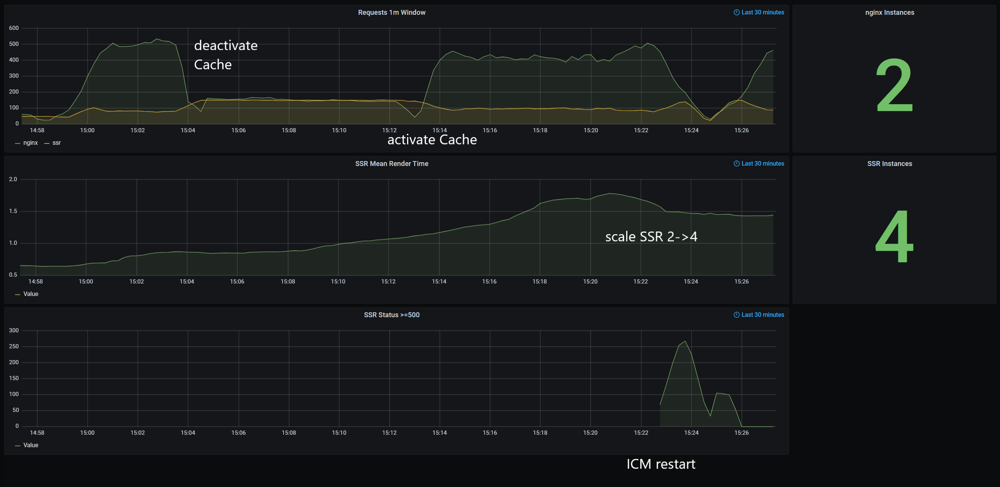

<!--
kb_guide
kb_pwa
kb_everyone
kb_sync_latest_only
-->

# Monitoring with Prometheus

The PWA can be monitored using [Prometheus](https://prometheus.io).

Activating the feature Prometheus for NGINX exposes metrics on port 9113 on the `/metrics` URL.

Activating the Prometheus feature for the express.js server exposes metrics on the `/metrics` URL on the same port it is running.

After activating the features on both containers, add tasks to prometheus:

```yaml
scrape_configs:
  - job_name: 'pwa-nginx'
    scrape_interval: 5s
    dns_sd_configs:
      - names:
          - 'tasks.pwa-nginx'
        type: 'A'
        port: 9113

  - job_name: 'pwa-ssr'
    scrape_interval: 5s
    dns_sd_configs:
      - names:
          - 'tasks.pwa-ssr'
        type: 'A'
        port: 4200
```

To get started, you can import our example [Grafana Dashboard][grafana-pwa-dashboard]:



:warning: We recommend to switch off the SSR container health-check and define alerts in Grafana instead.

# Further References

- [Nginx](../../nginx/README.md)
- [Guide - Building and Running Server-Side Rendering](../guides/ssr-startup.md)
- [Grafana Dashboard][grafana-pwa-dashboard]

[grafana-pwa-dashboard]: ./prometheus-monitoring-dashboard.json
