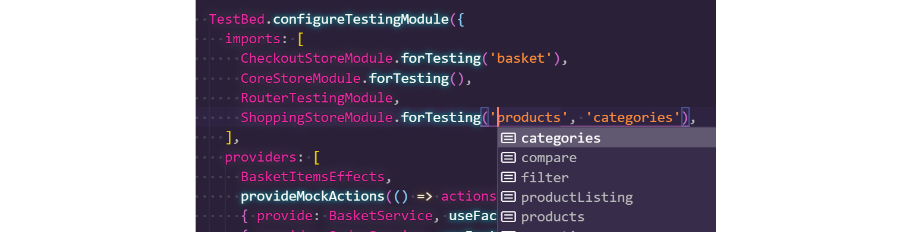

<!--
kb_guide
kb_pwa
kb_everyone
kb_sync_latest_only
-->

# Developing with NgRx

## NgRx Pitfalls

### Using Services and catchError

The operator handling the possible error of a service call must always be contained in the returned observable of the service call, otherwise it has no effect.

See: [Handling Errors in NgRx Effects](https://medium.com/city-pantry/handling-errors-in-ngrx-effects-a95d918490d9)

```typescript
@Effect()
effect = this.actions$.pipe(
  ofType(actionLoad),
  switchMap(this.service.method().pipe(
    map(x => actionSuccess(x)),
    mapErrorToAction(actionFail)
  ),
)
```

### Using `switchMap` can Lead to Race Conditions

Using flatmapping operators can lead to unexpected behavior.
If in doubt, use `concatMap`.

See [RxJS: Avoiding switchMap-Related Bugs](https://medium.com/angular-in-depth/switchmap-bugs-b6de69155524) for more information.

### Should I put XYZ into the Store or the Component?

Follow the [SHARI-Principle](https://ngrx.io/docs#when-should-i-use-ngrx-for-state-management).

## Testing NgRx Artifacts

### Using the State Management in Tests

With version 0.21 we introduced a new format for instantiating reducers and effects in `TestBed` for unit tests.
Each store module now has a `forTesting` method which provides a selective subset of reducers to be instantiated for testing.
The implementation is type safe and VSCode IntelliSense can be used:



If reducers for feature store modules are instantiated, the [CoreStoreModule][core-store-module] also has to be added to the `imports`.
It takes care of initializing the [`StoreModule.forRoot`](https://ngrx.io/api/store/StoreModule#forroot).
For more specific information consult the JSDoc of [CoreStoreModule][core-store-module].

[core-store-module]: ../../src/app/core/store/core/core-store.module.ts

### Reducers and Actions

Actions are simple data structures that require no testing.
Reducers are not part of the public API of the state management, so testing involves managing internals and should be kept to a minimum if not omitted at all.

### Selectors

Selectors in combination with Actions are part of the public API of the state management.
The test should be composed as an integration test.
A good model is to look at the store as a state machine, where actions trigger state transitions and selectors provide access to the new state.

### Effects

Effects implement business logic and should be tested individually.
If they do not depend on the NgRx Store, no reducers have to be instantiated.
For query interaction the new testing mechanism for [mocked stores](https://ngrx.io/guide/store/testing) can be used.
If the Effect heavily interacts with the state management, store modules have to be instantiated with the `forTesting` approach.
