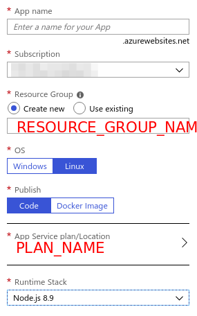
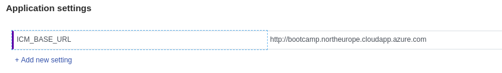
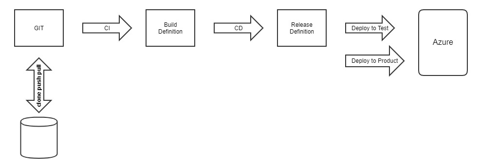
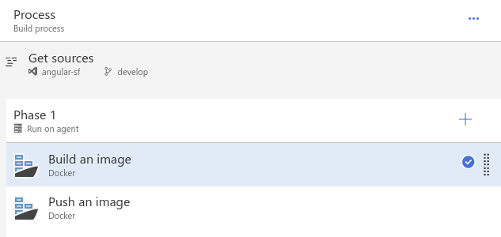
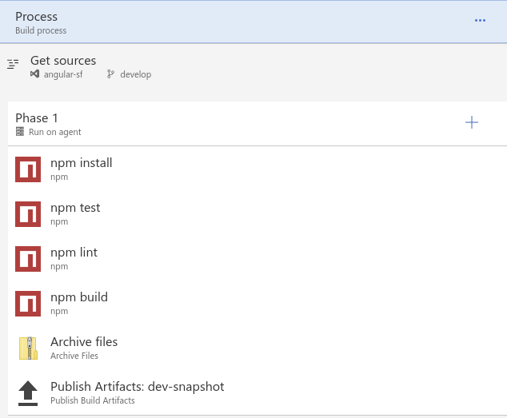
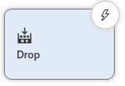
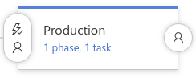

# Microsoft Azure Deployment

## Prerequisites

Make sure you have a deployment user at hand. If this is not the case, create one with Azure CLI: `az webapp deployment user set --user-name USERNAME --password PASSWORD.`

>  **Note**
>
>* Both USERNAME and PASSWORD settings have nothing to do with your Azure login. Do not mix them.
> * Replace RESOURCE\_GROUP\_NAME and PLAN\_NAME with meaningful values.

* You need to have a resource group with an Azure App Service plan. If this is not the case, create them with Azure CLI or with the Azure Portal:
  * To create the resource group: `az group create --name $RESOURCE_GROUP_NAME --location "West Europe"`
  * To create the app service plan: `az appservice plan create --name $PLAN_NAME --resource-group $RESOURCE_GROUP_NAME --sku S1 --is-linux`
* Make sure to select Linux as the underlying operating system.

## App Services


Azure App Services delivers PAAS nature to Azure customers. It contains a set of deployable apps for which you can choose basic runtime settings (depending on the app).

The Microsoft Web App allows you to deploy either NodeJS, Python, Java or .NET applications. Which means in whatever computer language your application is written, it must match the Web App's technology stack. As described above, Angular Universal needs a JavaScript runtime environment to fulfill the 'server' role. Consequently, we need to deploy a NodeJS runtime together with the Microsoft Web App. To do so, perform the following steps:

1. Create a Web App.
2. Specify a deployment setting (only Azure Portal).
3. Produce a production ready distribution with npm run build.
4. Use the `git push` command to trigger a deployment.

### Create a Web App

Depending on your taste, you can create a Web App with either Azure CLI or the Azure Portal. Within the portal just search for "Web App" from vendor Microsoft. You will see a creation dialog like this:



Specify a name, select Linux as OS, Runtime Stack, Publish (see next step) and select the correct App Service Plan (see the prerequisites chapter above). The same applies for the CLI.

**CLI to create a Web App**

````bash
az webapp create --resource-group $RESOURCE_GROUP_NAME --plan $PLAN_NAME --name NAME --runtime "NODE|8.9" --deployment-local-git
````

>  **Note**  
> The runtime stack of the Web App must be specified to be higher or equal to `Node.js 8.9`

### Specify a Deployment Setting

If Azure CLI was used in the previous step, you can fast forward to the next step [Produce a Production Ready Distribution](#produce-a-production-ready-distribution)

If the Node.js Web App was created with the Azure Portal, you must specify how to publish the app. If _Code_ was chosen as publish setting, this happens via FTP/ZIP upload or just Git.

To specify a _Code_ deployment:

1. Go to the created Web App and select _Deployment Center_.  
    Azure Portal will automatically ask you what source you want to configure.
2. Select _Local Git Repository_ as deployment option.  
    This will create an empty git repository connected with your Web App.

Another possibility is to choose _Docker Image_ as publish setting. In this guide we will not elaborate further on this option. All that is important is that the PWA comes with a Dockerfile that can be utilized for Docker-based deployments. The Azure Devops chapter picks this topic up again to ease builds and deployments.

### Produce a Production Ready Distribution

To produce a production ready distribution:

1. Go to the checked out source tree of the Intershop Progressive Web App.
2. Execute`npm run build`.  
This step takes some time and will produce a new version of the _./dist_ folder.

### Use Git Push to Trigger a Deployment

Use Git Push to trigger a deployment:

1. Go to a different folder and let Git clone your remote repository.
  >  **Info**  
  > You can copy the git URL from the _Overview_ tab of your created Web App.  
  > Search for  _Git clone url_. Make sure your created deployment user is part of that URL, e.g.,  _https://deploymentuser@webappname.scm.azurewebsites.net:443/webappname.git._

 This will produce another empty repository on your local machine. Go to the folder containing the repository and the work tree  (which is empty).

2. Copy the contents of the _dist_ folder from the previous step into your repository.
3. Run `git add` and `git push`.

**Example master**

````bash
λ git clone https://deploymentuser@webappname.scm.azurewebsites.net:443/webappname.git
Cloning into 'webappname'...
Password for 'https://deploymentuser@webappname.scm.azurewebsites.net:443': 
warning: You appear to have cloned an empty repository.

λ rsync -avz proof-of-concept/dist/ webappname
...
sent 6,255,008 bytes  received 3,748 bytes  4,172,504.00 bytes/sec
total size is 21,386,819  speedup is 3.42

λ git add .

λ git commit --message "Whatever it should"
...
 create mode 100644 server/ngsw.json
 create mode 100644 server/styles.bundle.css

λ git push
...
remote: Finished successfully.
remote: Running post deployment command(s)...
remote: Deployment successful.
remote: App container will begin restart within 10 seconds.
To https://webappname.scm.azurewebsites.net:443/webappname.git
 * [new branch]      master -> master
````

### Configure Intershop Commerce Management Backend

To configure Intershop Commerce Management Backend:

1. Go to the deployed Web App in the Azure Portal and select _Application settings._
2. Click on _Add new setting_ and provide the Intershop base URL (i.e., the place where ICM is hosted) under the name _ICM\_BASE\_URL. _
3. Apply with the _Save_ button.  
    The Node.js web application will use the value to construct REST URLs.



>  **HTTP and HTTPS**  
> Make sure that you choose a consistent protocol scheme for both applications, the Intershop Commerce Management and the Progressive Web App. Since Web Apps in Azure are using HTTPS automatically, the ICM\_BASE\_URL has to use HTTPS, too. Otherwise you risk a `Mixed Content:` error in the browser developer tools console.

>   **SSL handshake**  
> Intershop Commerce Management uses a self-signed certificate by default which does not carry any trust. Unless your ICM deployment configures a correct certificate, you have to manually tell your browser to trust the ICM backend. Otherwise the ssl handshake with the configured ICM\_BASE\_URL will fail resulting in a PWA error page. Details on this can be found using the browsers developer tooling.

## Azure Devops (Former VSTS)

### Introduction

With Azure Devops, it is possible to create a Git-based project that can be task managed (like JIRA), Wiki documented (like Confluence) and also continuously integrated. It also contains release management of previously build artifacts. In the end, such a release is deployed in Azure where it can become publicly available or end-to-end tested.



Angular apps can be easily managed with the aid of Azure Devops. It all begins with a `git clone` of a given project URL. After successful cloning of the remote repository you can work on the project. Start a new feature branch and once the feature is ready, create a pull request to merge changes into protected branches. All state changes can be configured to trigger a new build. A build artifact is defined by the 'Build Definition' that can be managed after logging into the Azure Devops account successfully (see info box above).

### Build Definition

Click on the project | _Build and Release | Build_ to open the available build definitions.

A definition is basically a set of tasks that needs to be configured. Tons of different tasks are available. Command scripts can be executed as part of a build step as well. A build definition also defines where that build is executed later (the so-called agent queue). By registering your own build agents (installed on some machines in your IT infrastructure), you can build artifacts in your own environment and let only releases leave your premises.

The easiest way to build the Intershop Progressive Web App is to use Docker build tasks, since our sources already contain Docker files that produce and test the necessary artifacts. The image below shows the complete implementation of the build process. It all starts with getting the sources with settings like name of the project and Git branch. In Phase 1 (executed on agents) an image is built, which is later being pushed to a docker container registry.



Every Docker build task wants to know about:

* Container registry
* Docker File
* Action to execute (building the image, pushing the image)
* Image Name
* Build Arguments
* Tags

Building a production build out of the PWA uses just  `npm run build` in a Multi-Step Docker build (see `Dockerfile`).

As an alternative approach, you can also rebuild all the tasks that are implemented in the Docker file used for the Docker-based build. However, this is not the recommended approach.



Let Node NPM build tasks, execute scripts delivered together with the sources. Zip everything together and publish the artifact in the VSTS project store later on. No container registry is needed for that.

Whatever fits best, the artifacts that are coming out of a build definition are not deployed (unless you add a deployment task). They are merely stored in a file system source ready to be picked up by a release process.

### Release Definition

The implementation of a release process (in a way continuous delivery) is done via release definition:

1. Click on the project | _Build and Release |_ _Releases_ to open the available definitions.  
    A release consumes artifacts from different sources, be it GitHub, VSTS Build Definition, VSTS Git repo, Azure Container Registry or even Jenkins. It is the starting point of such a release pipeline.  
    
2. Decide what to do with the artifact (called _Drop_ in the picture above).  
    To do so, you need to define an environment. Each environment has a pre-deployment condition that must be satisfied in order to proceed. Things like manual approval or quality gates based on reports that have been published together with the artifact are possible. A specific deployment process that can be tailored just like the build definitions comes with the environment. Once again, there are agents that execute different tasks. These tasks can be found within the marketplace. Tasks to deploy to Microsoft Azure are available.  
    

    The straight forward approach is to deploy an artifact into Azure App Services. You just need one phase and one 'Azure App Service Deploy' task in that phase. The deploy task asks for:

    * Azure Subscription
    * App type
    * App Service name
    * Image Source (Container Registry or Built-in Image)

    Image Source setting determines whether a Docker image will be pulled from the given container registry or such an image will be created by Azure itself. If _Built-in Image_ is selected, you have to define what kind of runtime stack you need (i.e., Node.js, Ruby, PHP, .NET). Either way docker is the easiest way, but you can also let Azure create the image for you. All you need is a web app that is compatible with the available runtime stacks. For the Intershop Progressive Web App based Storefront, the Node.js environment would be suitable.
