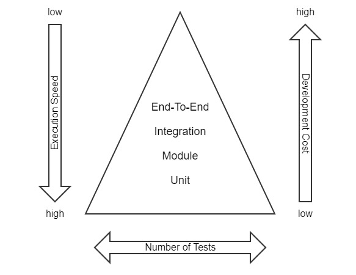

# Testing

## Testing Concept

Testing the PWA follows the basic principle of the test pyramid ([https://martinfowler.com/bliki/TestPyramid.html](https://martinfowler.com/bliki/TestPyramid.html)).



### Unit

Most of the testing should be done in low-level unit tests if possible. These tests concern themselves with the behavior of a single unit of code, be it a function, a class or even an Angular component with HTML rendering. All dependencies of that unit shall be mocked out to keep the scope as small as possible. These tests are written in a [Jasmine](https://jasmine.github.io/)\-like style and executed with [Jest](https://facebook.github.io/jest/). Running these tests can be very time-efficient and they serve as the primal short-circuit response to developers.

### Module

Following unit tests we also run module tests which serve as the first layer of integration tests. With these tests more dependencies are instantiated in every single test to check the behavior when interconnecting more components. Examples for these are testing a slice of the ngrx store or checking form validation with multiple Angular components. They are also implemented using [Jest](https://facebook.github.io/jest/).

### Integration

The next layer of tests are integration tests which run the application as a whole but mock out ICM rest responses. The test is run using a browser and performing various actions and checks on the application. For this kind of test [Cypress](https://www.cypress.io/) is required. The tests are written in a Jasmine-like behavior driven style. For the ease of readability we implemented them using a _PageObject_ pattern, see [https://martinfowler.com/bliki/PageObject.html](https://martinfowler.com/bliki/PageObject.html). Testing in this stage is of course more time-consuming as the application has to be compiled and started up as a whole. The fact of mocking server responses also limits the available workflows of the application. For example designing Mock-Data for a complete customer journey through the checkout would be too complex and too brittle. Nevertheless, the tests serve well for a basic overview of some functionality.

### End-to-End

The most time-consuming tests are complete end-to-end tests. They do not mock out anything and run the PWA against an ICM with a deployed `a_responsive:inspired-b2x`. We also use [Cypress](https://www.cypress.io/) here. Additionally, all tests from the previous Integration step should be composed in a way that they can also be run with real REST Responses. As a basic rule of thumb we only test happy path functionality or workflows that would be too cumbersome to be mocked in module tests.

## Test File Locations

Unit and module tests are closely located next to the production source code in the `src` folder.

Integration and end-to-end tests currently reside in _cypress/integration/specs_. _PageObjects_ are located in _cypress/integration/pages_. If the filename of a spec contains the string `mock`, it is run as an integration test with mocked server API. If it (additionally) contains `b2c` or `b2b` the test also should run on the PWA set up with the corresponding channel.

## Deviation from Standard Angular Test Frameworks

By default Angular Projects are setup with [Jasmine](https://jasmine.github.io/) and Karma Runner for unit and module tests, as well as [Protractor](https://www.protractortest.org) for end-to-end Testing. We decided to deviate from these frameworks, because there are better alternatives available.

[Jest](https://facebook.github.io/jest/) provides a better and faster experience when testing. Jest uses a JavaScript engine comparable to a virtual browser. There is no need to start up a real browser like it is standard with Jasmine+Karma. Also Jest provides an interactive command line interface with many options. Integrations for VSCode are available that will ease developing and running tests. Another big advantage of Jest is the functionality for [Snapshot Testing](https://jestjs.io/docs/en/snapshot-testing).

We also do not use Protractor for end-to-end testing. Like all Selenium-based testing frameworks, Protractor deals with the same problems. Special Bindings for the programming language communicate via HTTP with a browser driver which then remotely controls the browser over HTTP. This indirect way is very fragile against network latency. Also the functionalities are limited. Protractor, however, is especially designed for Angular, so it automatically waits for background tasks to finish before continuing the test run. This functionality must be implemented when using Cypress.

Cypress uses a different approach for running end-to-end tests. It runs directly in the browser and thus provides access to application internals like XHR-Monitoring, access to LocalStorage and so on. The interface also provides page snapshots for debugging, which in turn ease the experience when writing tests or reconstructing bugs. We use Cypress with a _PageObject_ pattern.

## PageObject Pattern

As mentioned earlier, we divide end-to-end tests in _PageObjects_ and Specs. _PageObjects_ abstract the HTML of the pages and provide a human-readable way of accessing to implement test-describing business processes. In that way _PageObjects_ also make certain routines re-usable over all tests. The Specs use these provided _PageObject_ functions to make assertions and trigger actions. _PageObjects_ themselves should not make assertions. All intended assertions should only be made in Specs. Specs are the main entry point for Developers. All test-related data and intended behavior should only be available in each single file.

No form of abstraction shall be made when developing tests, especially not for re-using code. Prefer Composition and introduce action methods in _PageObjects_ instead.

## Handling Test Data

For unit and module tests test data is instantiated as required. Each test should only set fields actually required for each test to ease readability. If new dependencies are introduced or workflows change, the corresponding test cases have to change, too.

Integration and end-to-end tests are tailored for the inSPIRED (a_responsive) demo store. Used test data can be abstracted at the start of the file but at all times it should only be accumulated here to ease readability of these test cases. Further abstraction would lead to longer development cycles as it is harder to understand functionality of test cases if it is distributed among multiple files.

If projects want to re-use the supplied test cases, they have to adapt them in terms of Test Data.

The end-to-end tests have to be adapted as well. Styling and structural changes have to be handled in the _PageObjects_, which then are used over all Specs. If behavior of the customization differs from the blueprint store, the Specs have to be adapted as well.

## Testing Guidelines for Jest Tests

### Stick to General Unit Testing Rules

#### Single Responsibility

A test should test only one thing. One given behavior is tested in one and _only_ one test.

The tests should be independent from the others, that means no chaining and no run in a specific order is necessary.

#### Test Functionality - Not Implementation

A test is implemented incorrectly or the test scenario is meaningless if changes in the HTML structure of the component destroy the test result.

Example: The test fails if an additional input field is added to the form.

 **Wrong Test Scenario**

```typescript
it('should check if input fields are rendered on HTML', () => {
  const inputFields = element.getElementsByClassName('form-control');
  expect(inputFields.length).toBe(4);
  expect(inputFields[0]).toBeDefined();
  expect(inputFields[1]).toBeDefined();
  expect(inputFields[2]).toBeDefined();
});
```

#### Do not Comment out Tests

Instead use the `xdescribe` or `xit` feature (just add an '`x`' before the method declaration) to exclude tests. This way excluded tests are still visible as skipped and can be repaired later on.


```typescript
xdescribe("description", function() {
  it("description", function() {
    ...
  });
});
```

#### Always Test the Initial State of a Service/Component/Module/...

This way the test itself documents the initial behavior of the unit under test. Especially if you test that your action triggers a change: Test for the previous state!


```typescript
it('should call the cache when data is available', () => {
    // precondition
    service.getData();
    expect(cacheService.getChachedData).not.toHaveBeenCalled();

    << change cacheService mock to data available >>

    // test again
    service.getData();
    expect(cacheService.getChachedData).toHaveBeenCalled();
});
```

#### Do not Test the Obvious

Testing should not be done for the sake of tests existing:

- It is not useful to test getter and setter methods and use spy on methods which are directly called later on.
- Do not use assertions which are logically always true.

#### Make Stronger Assertions

It is easy to always test with `toBeTruthy` or `toBeFalsy` when you expect something as a return value, but it is better to make stronger assertions like `toBeTrue`, `toBeNull` or `toEqual(12)`.


```typescript
it('should cache data with encryption', () => {
  customCacheService.storeDataToCache('My task is testing', 'task', true);
  expect(customCacheService.cacheKeyExists('task')).toBeTruthy();
});
```


```typescript
it('should cache data with encryption', () => {
  customCacheService.storeDataToCache('My task is testing', 'task', true);
  expect(customCacheService.cacheKeyExists('task')).toBeTrue();
});
```

Again, do not rely too much on the implementation. If user customizations can easily break the test code, your assertions are too strong.

 **Test too Close to Implementation**

```typescript
it('should test if tags with their text are getting rendered on the HTML', () => {
  expect(element.getElementsByTagName('h3')[0].textContent).toContain('We are sorry');
  expect(element.getElementsByTagName('p')[0].textContent).toContain(
    'The page you are looking for is currently not available'
  );
  expect(element.getElementsByTagName('h4')[0].textContent).toContain('Please try one of the following:');
  expect(element.getElementsByClassName('btn-primary')[0].textContent).toContain('Search');
});
```

 **Same Test in a more Stable Way**

```typescript
it('should test if tags with their text are getting rendered on the HTML', () => {
  expect(element.getElementsByClassName('error-text')).toBeTruthy();
  expect(element.getElementsByClassName('btn-primary')[0].textContent).toContain('Search');
});
```

#### Do not Meddle with the Framework

Methods like `ngOnInit()` are lifecycle-hook methods which are called by Angular – The test should not call it directly. When doing component testing, you most likely use `TestBed` anyway, so use the `detectChanges()` method of your available `ComponentFixture`.

 **Wrong Test with ngOnInit() Method Calling**

```typescript
it('should call ngOnInit method', () => {
  component.ngOnInit();
  expect(component.loginForm).toBeDefined();
});
```

 **Test without ngOnInit() Method Call**

```typescript
it('should contain the login form', () => {
  fixture.detectChanges();
  expect(component.loginForm).not.toBeNull();
});
```

### Assure Readability of Tests

#### Stick to Meaningful Naming

The test name describes perfectly what the test is doing.

 **Wrong Naming**

```typescript
it ('wishlist test', () => {...})
```

 **Correct Naming**

```typescript
it ('should add a product to an existing wishlist when the button is clicked', () => {...})
```

Basically it should read like a documentation for the unit under test, not a documentation about what the test does. [Jasmine](https://jasmine.github.io) has named the methods accordingly. Read it like \`I am describing <component>, it should <do> when/if/on <condition/trigger> (because/to <reason>)\`.

This also applies to assertions. They should be readable like meaningful sentences.


```typescript
const result = accountService.isAuthorized();
expect(result).toBeTrue();
```


```typescript
const authorized = accountService.isAuthorized();
expect(authorized).toBeTrue();
```

or directly

```typescript
expect(accountService.isAuthorized()).toBeTrue();
```

#### Avoid Global Variables

Tests should define Variables only in the scope where they are needed. Do not define Variables before `describe` or respective `it` methods.

#### Avoid Code Duplication in Tests

This increases readability of test cases.

- Common initialization code of constants or sub-elements should be located in `beforeEach` methods.
- When using `TestBed` you can handle injection to variables in a separate `beforeEach` method.


```typescript
it('should create the app', async(() => {
    const fixture = TestBed.createComponent(AppComponent);
    const component = fixture.componentInstance;
    ...
});
it('should have the title "app"', async(() => {
    const fixture = TestBed.createComponent(AppComponent);
    const component = fixture.componentInstance;
   ...
});
it('should match the text passed in Header Component', async(() => {
    const fixture = TestBed.createComponent(AppComponent);
});
```


```typescript
describe('AppComponent', () => {
    let translate: TranslateService;
    let fixture: ComponentFixture<AppComponent>;
    let component: AppComponent;

    beforeEach(async(() => {
        TestBed.configureTestingModule({
            declarations: [ ... ] });
        fixture = TestBed.createComponent(AppComponent);
        component = fixture.componentInstance;
    })
    it('should create the app', () => { ... });
    it(\`should have as title 'app'\`, () => { ... });
    it('should match the text passed in Header Component', () => { ... });
});
```

#### Do not Use Features You Do not Need

This increases readability of test cases.

If you do not need the functionality of :

- `ComponentFixture.debugElement`
- `TestBed`
- `async, fakeAsync`
- `inject`

... do not use it.

 **Wrong Test With Useless Features (TestBed, ComponentFixture.debugElement)**

```typescript
it('should create the app', async(() => {
  const app = fixture.debugElement.componentInstance;
  expect(app).toBeTruthy();
}));
```

 **Same Test - Works Without These Features**

```typescript
it('should be created', () => {
  const app = fixture.componentInstance;
  expect(app).toBeTruthy();
});
```

#### Structure Long Tests

The `describe` methods in Jasmine are nestable. You can use this to group various `it` methods into a nested `describe` where you can also use an additional `beforeEach` initialization method.

 **Nested describe Methods**

```typescript
describe('AccountLogin Component', () => {
    it('should be created', () => { ... });
    it('should check if controls are rendered on Login page', () => { ... });
    ....
    describe('Username Field', () => {
        it('should be valid when a correct email is assigned', () => { ... });
       ....
    });
});
```

#### Avoid Having Dead Code

Always only declare what you need. Unused variables, classes and imports reduce the readability of unit tests.

#### Use a Mocking Framework Instead of Dealing with Stubbed Classes

This way less code needs to be implemented which again increases readability of unit tests. Also mocks can be stubbed on time, depending on the current method. We decided to use _ts-mockito_ as the Test Mocking Framework.

### Do not Change Implementation to Satisfy Tests

#### DOM Element Selection

Use only IDs or definite class names to select DOM elements in tests. Try to avoid general class names.

 **Wrong Selector**

```typescript
const selectedLanguage = element.getElementsByClassName('hidden-xs');
```

 **Correct Selector**

```typescript
// by id

const selectedLanguage = element.querySelector('#language-switch');

// by class

const selectedLanguage = element.getElementsByClassName('language-switch');
```

#### DOM Changes for Tests

Use `data-testing-id` via attribute binding to implement an identifier used for testing purpose only.

 **Correct Testing ID**

\*.component.html

```html
<ol class="viewer-nav">
  <li *ngFor="let section of sections" [attr.data-testing-id]="section.value">{{ section.text }}</li>
</ol>
```

\*.spec.ts

```typescript
element.querySelectorAll('[data-testing-id]')[0].innerHTML;

element.querySelectorAll("[data-testing-id='en']").length;
```

>  **Note**
> Do not overuse this feature!

### Stick to Intershop Conventions Regarding Angular Tests

#### Every Component Should Have a 'should be created' Test

Every component should have a 'should be created' test like the one Angular CLI auto-generates. This test handles runtime initialization Errors.


```typescript
it('should be created', () => {
  expect(component).toBeTruthy();
  expect(element).toBeTruthy();
  expect(() => fixture.detectChanges()).not.toThrow();
});
```

#### Choose the Right Level of Abstraction

- When working mainly with stubs for specific services which mock dependencies of services under test, you should mainly use spies to check whether the right methods of the stub are called.
- When working mainly with fully configured services, it is best to check return values.
- When testing complex scenarios (e.g., when the test has to handle multiple pages), it might be better to implement a Geb+Spock end to end test.

See [Three Ways to Test Angular Components](https://vsavkin.com/three-ways-to-test-angular-2-components-dcea8e90bd8d) for more information.

### Be Aware of Common Pitfalls

#### Be Careful When Using `toBeDefined`

Be careful when using `toBeDefined`, because a dynamic language like JavaScript has another meaning of defined (see: [Is It Defined? toBeDefined, toBeUndefined](http://www.safaribooksonline.com/library/view/javascript-testing-with/9781449356729/ch04.html)).

>  **Warning**  
> Do not use `toBeDefined` if you really want to check for not null because technically 'null' is defined. Use `toBeTruthy` instead.

#### Be Careful With Variable Initialization

Jasmine does not automatically reset all your variables for each test like other test frameworks do. If you initialize directly under `describe`, the variable is initialized only once.

>  **Warning**  
> Since tests should be independent of each other, do not do this.

```typescript
describe(... () => {
  let varA = true;    // if changed once, value is not initialized again
  const varB = true;  // immutable value
  let varC;           // initialized in beforeEach for every test

  beforeEach({ varC = true; });

  it( 'test1' () => {
    varA = false;
    // varB = false; not possible
    varC = false; });
  it( 'test2' () => {
    // varA is still false
    // varB is still true
    // varC is back to true
  })
});
```

As shown in the above example, `varA` shows the wrong way of initializing variables in tests.

If you do not need to change the value, use a `const` declaration like variable `varB`. If you need to change the value in some tests, assure it is reinitialized each time in the `beforeEach` method like `varC`.

#### Use the right way to test EventEmitter

Testing `EventEmitter` firing can be done in multiple ways that have advantages and disadvantages. Consider the following example:

```typescript
import { EventEmitter } from '@angular/core';
import { anything, capture, deepEqual, spy, verify } from 'ts-mockito';

describe('Emitter', () => {
  class Component {
    valueChange = new EventEmitter<{ val: number }>();

    do() {
      this.valueChange.emit({ val: 0 });
    }
  }

  let component: Component;

  beforeEach(() => {
    component = new Component();
  });

  it('should detect errors using spy with extract', () => {
    // *1*
    const emitter = spy(component.valueChange);

    component.do();

    verify(emitter.emit(anything())).once();
    const [arg] = capture(emitter.emit).last();
    expect(arg).toEqual({ val: 0 });
  });

  it('should detect errors using spy with deepEqual', () => {
    // *2*
    const emitter = spy(component.valueChange);

    component.do();

    verify(emitter.emit(deepEqual({ val: 0 }))).once();
  });

  it('should detect errors using subscribe', done => {
    // *3*
    component.valueChange.subscribe(data => {
      expect(data).toEqual({ val: 0 });
      done();
    });

    component.do();
  });
});
```

As `EventEmitter` is `Observable`, subscribing to it might be the most logical way of testing it. We, however, would recommend using `ts-mockito` to increase readability. The ways 1 and 2 portrait two options, we would recommend using the first one.

|                                | 1 (preferred)                                                                                                                     | 2                                                                               | 3                                                                                              |
| ------------------------------ | --------------------------------------------------------------------------------------------------------------------------------- | ------------------------------------------------------------------------------- | ---------------------------------------------------------------------------------------------- |
| Description                    | - Using ts-mockito spy and then verify it has fired - Then check argument for expected value                                      | Using ts-mockito spy and then verify it has fired with the expected value       | - Using subscription and asynchronous method safeguard                                         |
| Readability                    | Capturing arguments with ts-mockito might seem tricky and therefore reduces readability, but the test is done in the right order. |  Right order, fewest lines of code                       |  Order is reversed.                                                 |
| In case it does not emit       |  Correct line number and a missing emission is reported.                                                   |  Correct line number and a missing emission is reported. |  Test runs into timeout as the asynchronous callback is not called. |
| In case it emits another value |  Correct line number and an incorrect value is reported.                                                   |  Missing emission is reported.                       |  Correct line number and an incorrect value is reported.                |
